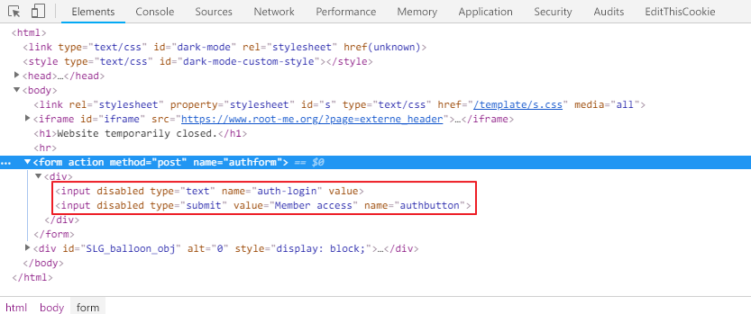

Root-Me [HTML - disabled buttons](https://www.root-me.org/en/Challenges/Web-Client/HTML-disabled-buttons)
===

該題提供一個 `Input` 與一個 `Submit`，但皆無法使用。

## 解題關鍵
1. 檢視原始碼
2. 修改原始碼

## 解題方法
首先打開原始碼可以看到以下的畫面。  
  

```HTML
<input disabled="" type="text" name="auth-login" value="">
<input disabled="" type="submit" value="Member access" name="authbutton">
```

把 `disabled` 拿掉，就可以輸入、送出了。

## 授權聲明
[](https://mks.tw/)
[](https://www.gnu.org/licenses/gpl-3.0)