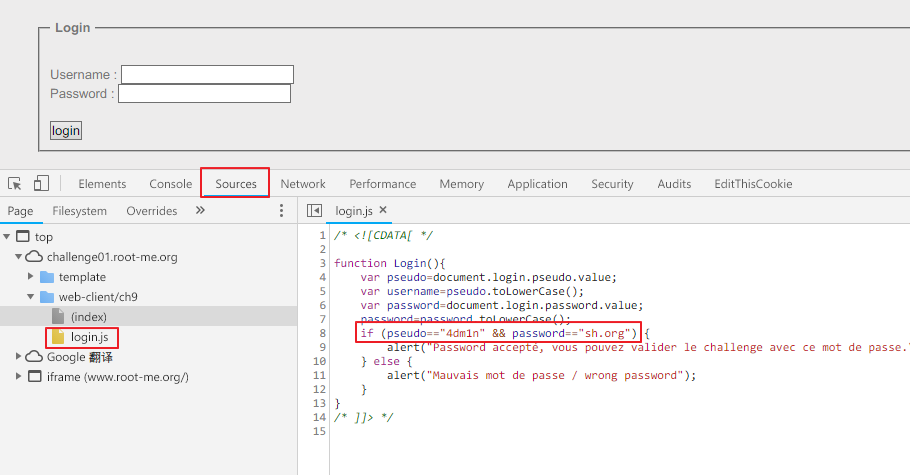

Root-Me [Javascript - Authentication](https://www.root-me.org/en/Challenges/Web-Client/Javascript-Authentication)
===

一個簡易的登入頁面。

## 解題關鍵
1. 查看原始碼

## 解題方法
解題方法一樣看原始碼，並切換到 `source`，可以查看到該頁面有讀取那些 js，隨即就發現 `login.js`，並且瀏覽該檔案內容。  

  

可以發現關鍵程式碼如下。  
```javascript
	if (pseudo=="4dm1n" && password=="sh.org") {
	    alert("Password accepté, vous pouvez valider le challenge avec ce mot de passe.\nYou an validate the challenge using this password.");
	} else { 
	    alert("Mauvais mot de passe / wrong password"); 
	}
```


## 授權聲明
[](https://mks.tw/)
[](https://www.gnu.org/licenses/gpl-3.0)