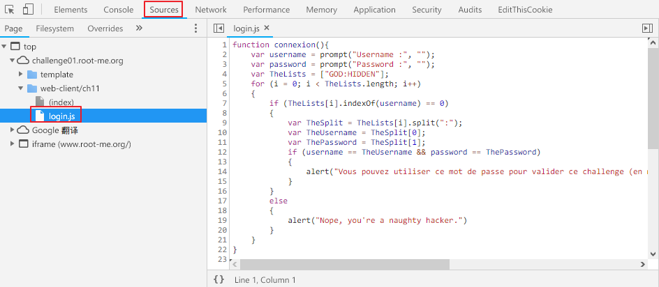

Root-Me []()
===

該題提供一個登入功能，點擊頁面上的 `Login` 便會要求輸入帳號、密碼。

## 解題關鍵
1. 檢視原始碼
2. JavaScript

## 解題方法
檢視原始碼不用說了，方法與第二題完全相同，但該題需要一點 `JavaScript` 基礎。  

  

從圖中可以看到 `username == TheUsername` 並且 `password == ThePassword`，所以我們要追查變數的來源，首先 `username`、`password` 為 input 的值，所以要追查的是 `TheUsername`、`ThePassword`。

```JavaScript
var TheLists = ["GOD:HIDDEN"];
var TheSplit = TheLists[i].split(":");
var TheUsername = TheSplit[0];
var ThePassword = TheSplit[1];
```

首先向上追查有關的程式碼如上，變數 `TheLists` 為 `GOD:HIDDEN`，而 `TheSplit` 的功能便是以 `;` 為中心做切割，便會變成 `GOD`、`HIDDEN` 兩個變數，並存放到 `TheUsername`、`ThePassword` 中，這樣就真相大白了，該題拿下。

## 授權聲明
[](https://mks.tw/)
[](https://www.gnu.org/licenses/gpl-3.0)