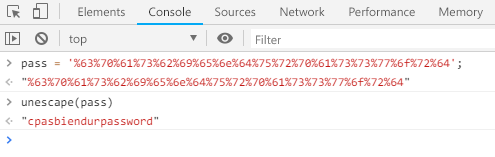

Root-Me [Javascript - Obfuscation 1](https://www.root-me.org/en/Challenges/Web-Client/Javascript-Obfuscation-1)
===

該題與第三題一樣，一進到題目就跳窗要你登入。

## 解題關鍵
1. 檢視原始碼
2. JavaScript

## 解題方法
該題比較簡單一點，可以透過瀏覽器的開發者工具來進行解題，首先一樣透過檢視原始碼發現以下的程式碼片段。  

```JavaScript
/* <![CDATA[ */

pass = '%63%70%61%73%62%69%65%6e%64%75%72%70%61%73%73%77%6f%72%64';
h = window.prompt('Entrez le mot de passe / Enter password');
if(h == unescape(pass)) {
    alert('Password accepté, vous pouvez valider le challenge avec ce mot de passe.\nYou an validate the challenge using this pass.');
} else {
    alert('Mauvais mot de passe / wrong password');
}

/* ]]> */

```

由於不清楚 `pass` 到底是什麼東西，然後輸入的值要與 `unescape(pass)` 相等，就藉由開發者工具來翻譯吧，拿下該題。  

  

## 授權聲明
[](https://mks.tw/)
[](https://www.gnu.org/licenses/gpl-3.0)