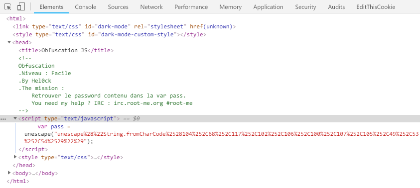
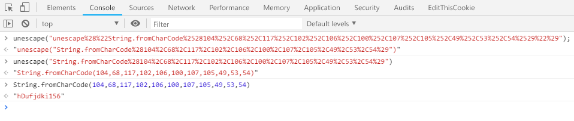

Root-Me [Javascript - Obfuscation 2](https://www.root-me.org/en/Challenges/Web-Client/Javascript-Obfuscation-2)
===

一片空白

## 解題關鍵
1. 打開原始碼
2. JavaScript

## 解題方法
打開原始碼後可以看到很關鍵的東西，與上一題一模一樣，可以直接丟給開發者工具執行。  

  

但會發現跑完一次之後，又出現了類似的東西，於是再複製、貼上、執行，直到最後拿到 Flag。  

  

## 授權聲明

