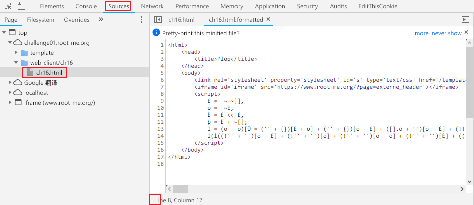
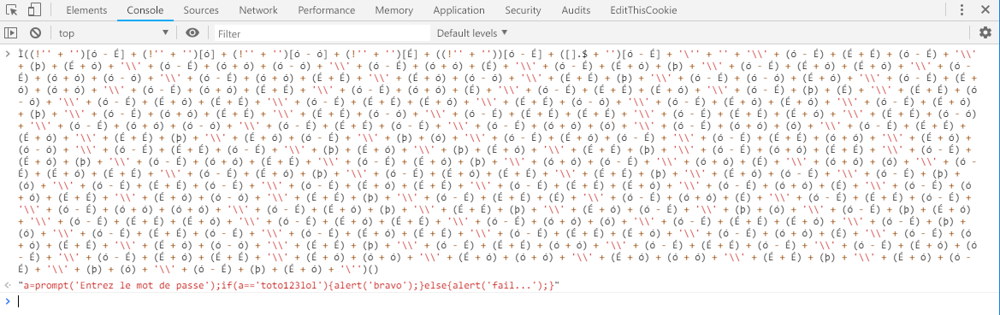

Root-Me 
===

該題又是一進去就跳窗騷擾的

## 解題關鍵
1. 檢視原始碼
2. JavaScript

## 解題方法
該題檢視原始碼之後會發現有點不一樣...，看起來是混淆過的程式碼，不要慌，透過開發者工具還是有辦法解決，首先透過 `Sources`，隨後點擊該文件，以及下方的 `{}` 符號，由於圖上的例子已經點了，他消失不見了...，但位置是一樣的。  

  

然後仔細觀察程式碼，`É`、`ó`、`Ë`、`þ` 都是變數，`Ì` 看起來是個函數，而下方 `Ì(Ì(...))` 感覺同一個函數執行了兩次，嘗試執行，卻還是如同剛進入頁面一般的跳窗，於是僅執行內部的函數，拿下該題。  

  

## 授權聲明

