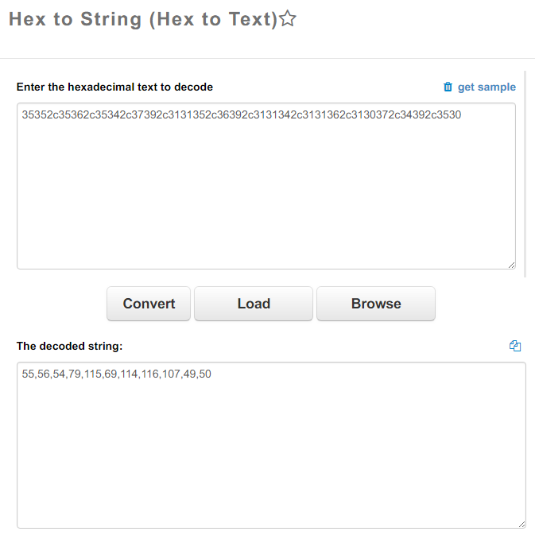

Root-Me [Javascript - Obfuscation 3](https://www.root-me.org/en/Challenges/Web-Client/Javascript-Obfuscation-3)
===

進入題目後跳窗，要你輸入點什麼。

## 解題關鍵
1. JavaScript

## 解題方法
這題就是 Code Review，沒有其他方法，查看原始碼找到以下的 Code。  

```JavaScript
function dechiffre(pass_enc) {
    var pass = "70,65,85,88,32,80,65,83,83,87,79,82,68,32,72,65,72,65";
    var tab = pass_enc.split(',');
    var tab2 = pass.split(',');
    var i, j, k, l = 0, m, n, o, p = "";
    i = 0;
    j = tab.length;
    k = j + (l) + (n = 0);
    n = tab2.length;
    for (i = (o = 0); i < (k = j = n); i++) {
        o = tab[i - l];
        p += String.fromCharCode((o = tab2[i]));
        if (i == 5)
            break;
    }
    for (i = (o = 0); i < (k = j = n); i++) {
        o = tab[i - l];
        if (i > 5 && i < k - 1)
            p += String.fromCharCode((o = tab2[i]));
    }
    p += String.fromCharCode(tab2[17]);
    pass = p;
    return pass;
}
String["fromCharCode"](dechiffre("\x35\x35\x2c\x35\x36\x2c\x35\x34\x2c\x37\x39\x2c\x31\x31\x35\x2c\x36\x39\x2c\x31\x31\x34\x2c\x31\x31\x36\x2c\x31\x30\x37\x2c\x34\x39\x2c\x35\x30"));

h = window.prompt('Entrez le mot de passe / Enter password');
alert(dechiffre(h));
```

比較關鍵的地方是 `dechiffre`，可以看到最後會 `return pass;`，也就是我們要的密碼，第二個關鍵點是 `p += String.fromCharCode(tab2[17]);`，可以發現最後一個值是 `tab2[17]`，所以目前至少掌握了一個密碼字元。  
其中迴圈的部分 `(k = j = n)`，但變數 `n` 取自 `tab2`，而 `tab2` 取自 `pass.split(',')` 顧得到 18。  

簡單整理出程式碼後，會變成下面的樣子。

```JavaScript
function dechiffre(pass_enc) {
    var pass = "70,65,85,88,32,80,65,83,83,87,79,82,68,32,72,65,72,65";
    var tab2 = pass.split(',');
    var i, j, k, l = 0, m, o, p = "";
    i = 0;
    for (i = 0); i < (18); i++) {
        p += String.fromCharCode(tab2[i]);
        if (i == 5)
            break;
    }
    for (i = 0); i < (18); i++) {
        if (i > 5 && i < 18 - 1)
            p += String.fromCharCode(tab2[i]);
    }
    p += String.fromCharCode(tab2[17]);
    pass = p;
    return pass;
}
```

各位應該不難發現，使用者輸入的部分根本沒有在 `dechiffre` 的函式中執行，而 `pass` 的值是什麼? 這邊就自行弄個腳本找出答案。

```JavaScript
var pass = "70,65,85,88,32,80,65,83,83,87,79,82,68,32,72,65,72,65".split(",");
var p = '';
for(i = 0; i < pass["length"]; i++){
	p += String.fromCharCode(pass[i]);
}
p = "FAUX PASSWORD HAHA";
```

所以這時候 `dechiffre` 函式執行結束，不管輸入什麼都會輸出 `FAUX PASSWORD HAHA`，但這並不是我們要的答案。  
在 `dechiffre` 函數結束後接著執行以下指令。  

```JavaScript
String["fromCharCode"](dechiffre("\x35\x35\x2c\x35\x36\x2c\x35\x34\x2c\x37\x39\x2c\x31\x31\x35\x2c\x36\x39\x2c\x31\x31\x34\x2c\x31\x31\x36\x2c\x31\x30\x37\x2c\x34\x39\x2c\x35\x30"));
```

可以猜測這邊的 `\x35\x35...\x30` 為 `HEX` 16 進制，先自行加工一下，將 `\x` 去除，如下。

```
35352c35362c35342c37392c3131352c36392c3131342c3131362c3130372c34392c3530
```

借助線上工具將 `Hex` 轉為 `String`。  



得到以下  

```
55,56,54,79,115,69,114,116,107,49,50
```

是不是有些眼熟? 接著就可以透過剛剛的腳本來進行解碼，解決該題。

```JavaScript
var pass = "55,56,54,79,115,69,114,116,107,49,50".split(",");
var p = '';
for(i = 0; i < pass["length"]; i++){
	p += String.fromCharCode(pass[i]);
}
p = "786OsErtk12";
```

## 授權聲明
[](https://mks.tw/)
[](https://www.gnu.org/licenses/gpl-3.0)