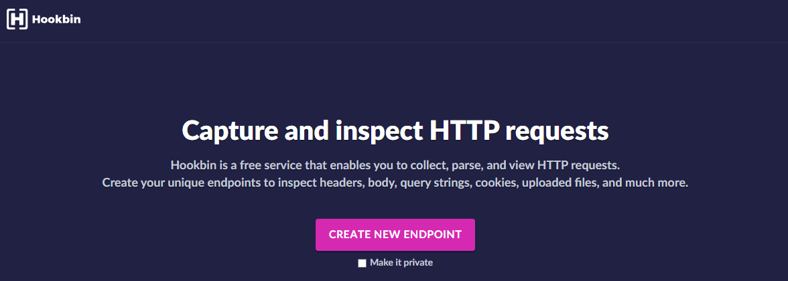

Root-Me [XSS - Stored 1](https://www.root-me.org/en/Challenges/Web-Client/XSS-Stored-1)
===

看起來像是個留言板。

## 解題關鍵
1. XSS
2. JavaScript

## 解題方法
首先嘗試注入 `<script>alert("Hello World")</script>`，發現可以成功注入，並沒有做任何的過濾。  


接著發現機器人會定期瀏覽該頁面，如下圖。


所以該題的目標大概就是透過 XSS 注入，並竊取其它用戶組的 Cookie。  
構造該題的 Payload，可以運用 ``，瀏覽器讀取 `` 標籤會採用 GET 訪問，若是可以夾帶 Cookie 並對 img 的來源進行訪問，來源端的主機便會留下包含 Cookie 的 log 紀錄，所以首先必須要先有一台對外的主機，這邊可以使用 [hookbin.com](https://hookbin.com) 的線上服務，當在主頁上按下 `CREATE NEW ENDPOINT` 後便會亂數產生一組 URL，便可以用這組 URL 來接收資料。  

  
  

至於 Payload 如何構造，就必須結合 `<script>` 與 `` 了，如下。  

```HTML
<script>document.write("")</script>
```

送出之後，可以刷新頁面（不建議使用 F5，因為送出的 Payload 會重送），隨後發現訊息被清掉，而顯示 `Message read`，就回到 `hookbin` 上查看是否成功把資料偷出來了。  


結束該題。  

## 授權聲明
[](https://mks.tw/)
[](https://www.gnu.org/licenses/gpl-3.0)