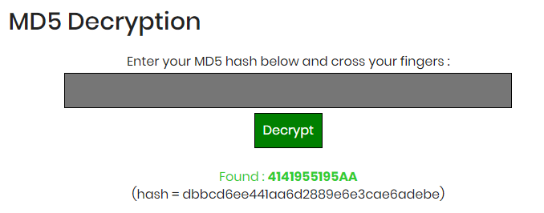

Root-Me []()
===

一個 Flash，然後有四個數字。

## 解題關鍵

## 解題過程
首先亂按，就會跳出個 `Authentication Failed`，對於 Flash 這東西完全不熟，完全沒概念阿!!  
接著打開開發者工具，發現在 `Console` 的部分，每點擊一下，就會觸發一次 `press` 事件，其中 `1`、`2`、`3`，只要點擊達 6 次，就會跳出 `Authentication Failed` 訊息，而 `4` 不論怎麼點都沒反應，但還是會觸發 `press` 事件。  

隨後在原始碼的部分發現，以下這段程式碼。

```JavaScript
function l1(value) {
	if (value!="dbbcd6ee441aa6d2889e6e3cae6adebe") {
	    alert('Authentication Failed');
    } else {
	    alert('Authentication Success');
    }
}
```

看樣子是要想辦法觸及 `1`、`2`、`3`、`4` 來達成字串 `dbbcd6ee441aa6d2889e6e3cae6adebe`，但這一行字串到底是什麼呢?  

首先該字串長度為 `32` 碼，初步研判為 MD5，若直接透過線上 MD5 解碼，看看能不能得到些什麼（[Tool](https://www.md5online.org/md5-decrypt.html)）。  

得到了： `4141955195AA` 如下圖。  

  

我們已經知道只能輸入 6 個數字，但 `4141955195AA` 共有 12 個字元，若拆成兩個一組呢? `41 41 95 51 95 AA`，但還是不知道該如何用 `1`、`2`、`3`、`4` 來代表這些字元，所以透過瀏覽器的開發者工具中的 Debug Mode，來得知送至 `l1` Function 的參數為何，簡單整理如下。

input | output | MD5 Decrypt
---------|----------|---------
 111111 | fb86fbf268caac98db28f43acf074761 | BABABABABABA
 222222 | 35e479a04fc03bb46654894acf742eea | 414141414141
 333333 | 7e137ba035238babe49ef64259e26513 | 959595959595

交互點擊：

input | output | MD5 Decrypt
---------|----------|---------
 4141414141414141414141 | 7ac8df641cfdbd708cbfe485b021f5aa | BAAAAAAAAAAA
 4242424242424242424242 | 3e99b05749910b98d513e806a04e01dd | 411111111111
 4343434343434343434343 | 9b574d49ac38cbaebb4f9dcac3598434 | 955555555555

有些奇怪的是，明明只能輸入六碼，計算包含與 `4` 的組合，可以發現有 10 組數字，從以上的規則可以發現，`4` 若當地一位，是沒有任何作用的，目前僅可以從解出 `223?314`，該題放棄!!!


## 授權聲明
[](https://mks.tw/)
[](https://www.gnu.org/licenses/gpl-3.0)