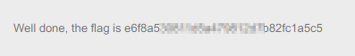
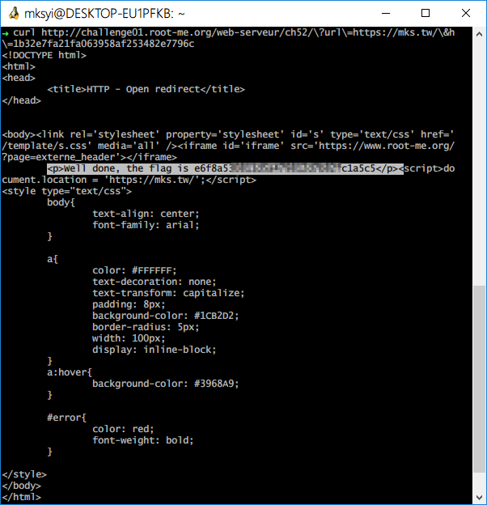

Root-Me [HTTP-Open-redirect](https://www.root-me.org/en/Challenges/Web-Server/HTTP-Open-redirect)
===

該題提供三個外部連結，查看 URL 有兩個參數 `url`、`h`，簡單判斷 `h` 為 Hash 的縮寫，可能是將 `url` 邊碼而成。  

```
md5(https://facebook.com) = a023cfbf5f1c39bdf8407f28b60cd134
md5(https://twitter.com) = be8b09f7f1f66235a9c91986952483f0
md5(https://slack.com) = e52dc719664ead63be3d5066c135b6da
```

## 解題關鍵
1. Open Redirect
2. Hash - MD5

## 解題方法
將外部連結 `MD5` 後，修改至連結 `url` 與 `h` 中。  
```
md5(https://mks.tw/) = 1b32e7fa21fa063958af253482e7796c

http://challenge01.root-me.org/web-serveur/ch52/?url=https://mks.tw/&h=1b32e7fa21fa063958af253482e7796c
```

透過以上連會發現有一個含有 Flag 的頁面閃過，如下。  

  

若要直接存取該頁面可以使用工具 `curl` 或是線上的 `HTTP Viewer` 工具等。



## 授權聲明
[](https://mks.tw/)
[](https://www.gnu.org/licenses/gpl-3.0)