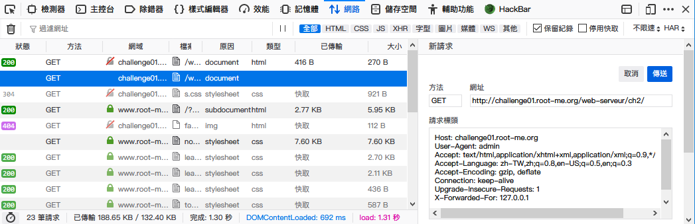
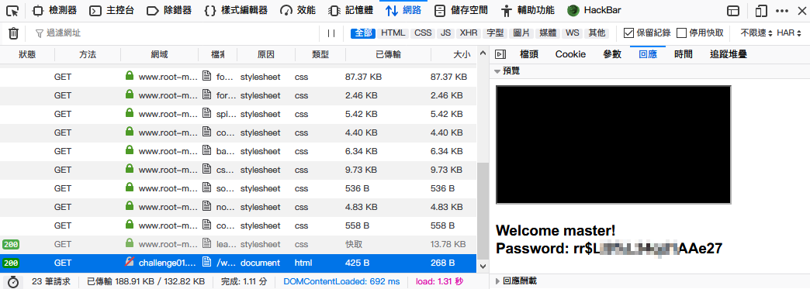

Root-Me [User-agent](https://www.root-me.org/en/Challenges/Web-Server/User-agent)
===

連結頁面之後有一行訊息「`Wrong user-agent: you are not the "admin" browser!`」，看樣子是要把 `user-agent`，修改成 `admin`。

## 解題關鍵
1. Edit HTTP Header
2. user-agent
3. curl

## 解題方法
簡單的說 `user-agent` 都是由瀏覽器本身自帶的，可作為識別使用者使用的設備、瀏覽器、瀏覽器版本等資訊，可以使用工具，或是使用 `Firefox` 內建的功能來解題。

### Step1
  

### Step2
  

## 授權聲明

