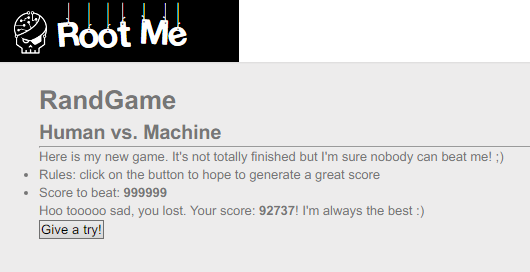
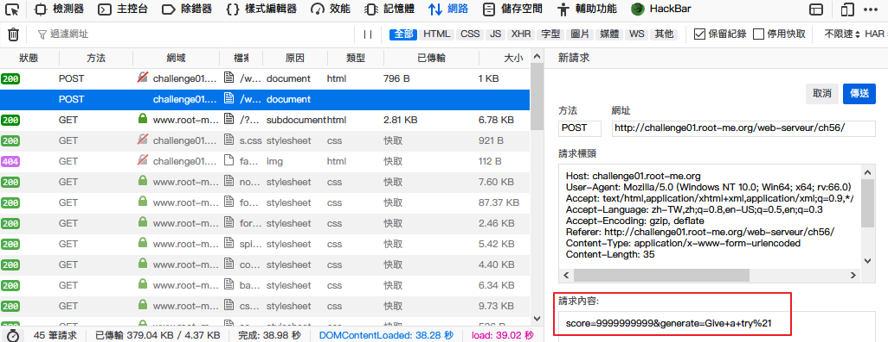
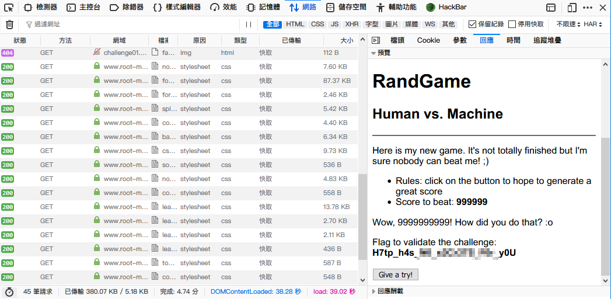

Root-Me [HTTP - POST](https://www.root-me.org/en/Challenges/Web-Server/HTTP-POST)
===

該題的頁面上顯示一組關鍵字串「`Score to beat: 999999`」以及一組數字 `999999`，下方按鈕點擊後，則會隨機送出一組數字，簡單的說數字要大於 `999999`。

  

## 解題關鍵
1. Edit POST Data
2. Curl
3. Brup Suite

## 解題方法
該題的解法與 `User-agent` 那題一樣，可以使用 `Firefox` 自帶的開發者工具來進行解題。

### Step1
首先找到點即按鈕後的 POST 頁面，並且進行模仿、修改，將參數值設置為大於 `999999`，並且送出即可。  

  

### Step2
隨後可以在回應簽頁中找到內容，並發現 Flag。  

  

## 授權聲明

