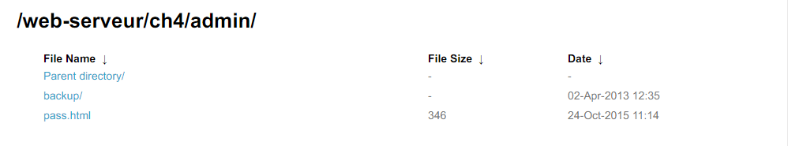

Root-Me [HTTP directory indexing](https://www.root-me.org/en/Challenges/Web-Server/HTTP-directory-indexing)
===

首先這題跟台灣的國防部似乎有合作...，題目頁面一片空白，完全沒有畫面阿。

## 解題關鍵
1. 檢視原始碼

## 解題方法
首先檢視原始碼發現頁面 `admin/pass.html`，並且留下以下提示。

```
J'ai bien l'impression que tu t'es fait avoir / Got rick rolled ? ;)
T'inquiète tu n'es pas le dernier / You're not the last :p

Cherche BIEN / Just search
```

隨後將 `pass.html` 移除，瀏覽 `admin/` 可以以目錄方式檢視，並發現有 `backup` 資料夾。

  

其中發現文件 `/backup/admin.txt` 文件，內文如下。

```
Password / Mot de passe : LINUX
```

## 授權聲明
[](https://mks.tw/)
[](https://www.gnu.org/licenses/gpl-3.0)