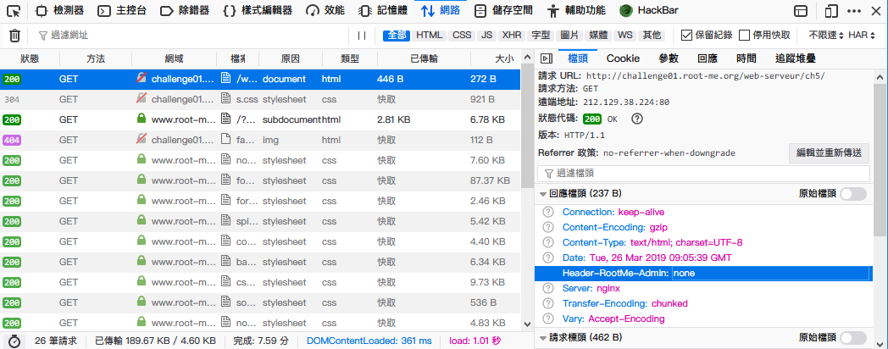

Root-Me [HTTP Headers](https://www.root-me.org/en/Challenges/Web-Server/HTTP-Headers)
===

一進到頁面就吐一段話給你，如下。  
```
Content is not the only part of an HTTP response!
```

## 解題關鍵
1. 開發者工具
2. Curl
3. Brup Suite

## 解題方法
在該頁面上檢視 `Header`，發現有一個特殊的 Header `Header-RootMe-Admin: none`。  
  

藉此發送請求，加上同樣的 Header，值為任意值。  

  

然後就得到 Flag。  

  


## 授權聲明
[](https://mks.tw/)
[](https://www.gnu.org/licenses/gpl-3.0)