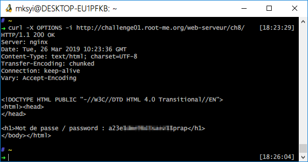

Root-Me [HTTP verb tampering](https://www.root-me.org/en/Challenges/Web-Server/HTTP-verb-tampering)
===

該題到頁面上就彈窗，要你輸入帳號密碼。

## 解題關鍵
1. Http Method
2. Curl
3. Brup Suite

## 解題方法
看了該題的名稱，一直以為是動態要去攔截、修改某些值，於是用上了 `Brup Suite`，結果只要修改 Method 即可...。

## 授權聲明

