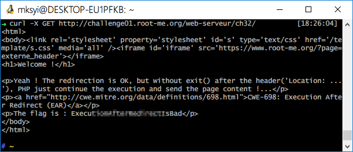

Root-Me [Improper redirect](https://www.root-me.org/en/Challenges/Web-Server/Improper-redirect)
===

登入頁面，但沒有其它提示。

## 解題關鍵
1. 302 Method
2. Curl

## 解題方法
首先到該頁面後，會發現被導到 `login.php` 的頁面，所以可以猜想，可能在導向之前的頁面上有 Flag，可以使用 Curl，HTTP Viewes 等工具來抓該頁面的資料。  

## 授權聲明

