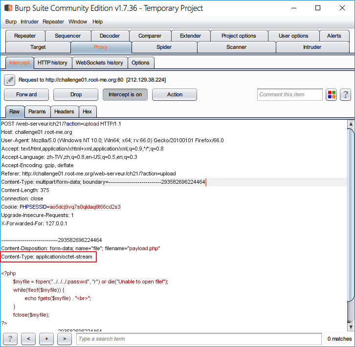
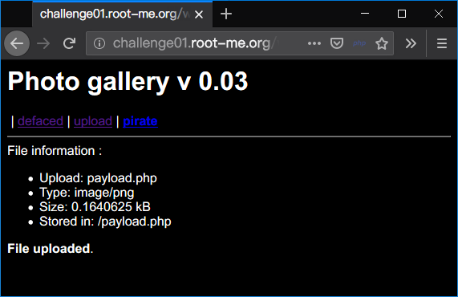

Root-Me [File upload - MIME type](https://www.root-me.org/en/Challenges/Web-Server/File-upload-MIME-type)
===

與上一題雷同，並且給了一樣的提示：
```
Your goal is to hack this photo galery by uploading PHP code.
Retrieve the validation password in the file .passwd at the root of the application.
```

## 解題關鍵
1. MIME Type
2. Burp Suite

## 解題方法
上傳功能有明文規定，僅能上傳 `.GIF`、`.JPEG`、`.PNG` 三種格式，使用與上一題同樣的方式上傳檔案，已經不管用了，最終還是會被解析成 `image` 格式。  

由於我們上傳 `.php.png` 的方式已經不管用，至於要如何繞過上傳的限制，並上傳 `php` 格式的檔案，該題的標題為 `MIME Type`，顧名思義，就從 `content type` 下手。  

首先打開 `Burp Suite`，並在上傳之前啟用 `Intercept`，並查看紅空處的 `content type` 為 `application/octet-stream`。  

  

若著手將他修改成 `image/png` 呢?  

  

不例外的上傳成功，接下來就是打開上傳成功的 php 檔案。

## 授權聲明
[](https://mks.tw/)
[](https://www.gnu.org/licenses/gpl-3.0)