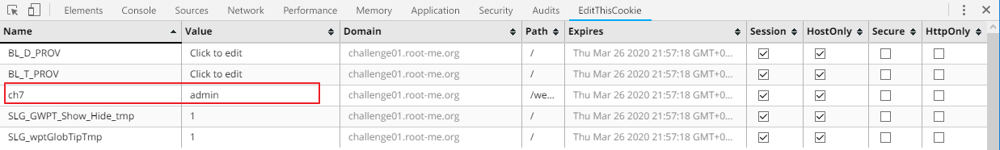

Root-Me [HTTP cookies](https://www.root-me.org/en/Challenges/Web-Server/HTTP-cookies)
===

該題的頁面是一個要你輸入 email 的視窗(?

## 解題關鍵
1. 檢視原始碼
2. Cookie

## 解題方法

### 線索一
首先頁面上有個超連結 `Saved email adresses`，點擊之後會跳出 `You need to be admin` 。

### 線索二
查看原始碼發現有一行註解，如下。  
```
<!--SetCookie("ch7","visiteur");-->
```

看樣子是只要將 `key` 為 `ch7` 的 `cookie` 設定為 admin 即可，如下圖紅圈處。

  


## 授權聲明
[](https://mks.tw/)
[](https://www.gnu.org/licenses/gpl-3.0)