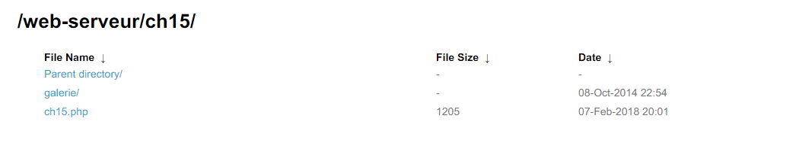
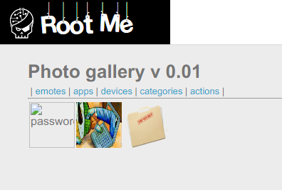

Root-Me [Directory traversal](https://www.root-me.org/en/Challenges/Web-Server/Directory-traversal)
===

首先這個頁面與前面檔案上傳的那幾題一樣，只是沒有上傳功能。

## 解題關鍵
1. 目錄/檔案
2. 檢視原始碼

## 解題方法
首先該題目的名稱為 `Directory traversal`，很直覺的將 `URL` 上的 `ch15.php` 拿掉，變成以目錄瀏覽，如下。  

  

但訪問 `galerie` 目錄，卻只回傳 403，這時候回到 `ch15` 的頁面上，點擊 `emotes`、`apps` 等...標籤尋找線索，發現 URL 的變化如下。  

```
?galerie=emotes
?galerie=apps
?galerie=devices
?galerie=categories
?galerie=actions
```

接著檢視頁面上圖片的 `URL`，發現都在 `galerie` 底下，猜測 `galerie` 的參數可能是路徑，將參數改為 `../galerie` 後發現有個名為 `86hwnX2r` 的資料夾或檔案，在此嘗試提交 Flag，但失敗，於是繼續往下追 `../galerie/86hwnX2r`，發現如下。  

  

接著直接造訪，`/galerie/86hwnX2r/password.txt`，結束此題。  

## 授權聲明
[](https://mks.tw/)
[](https://www.gnu.org/licenses/gpl-3.0)