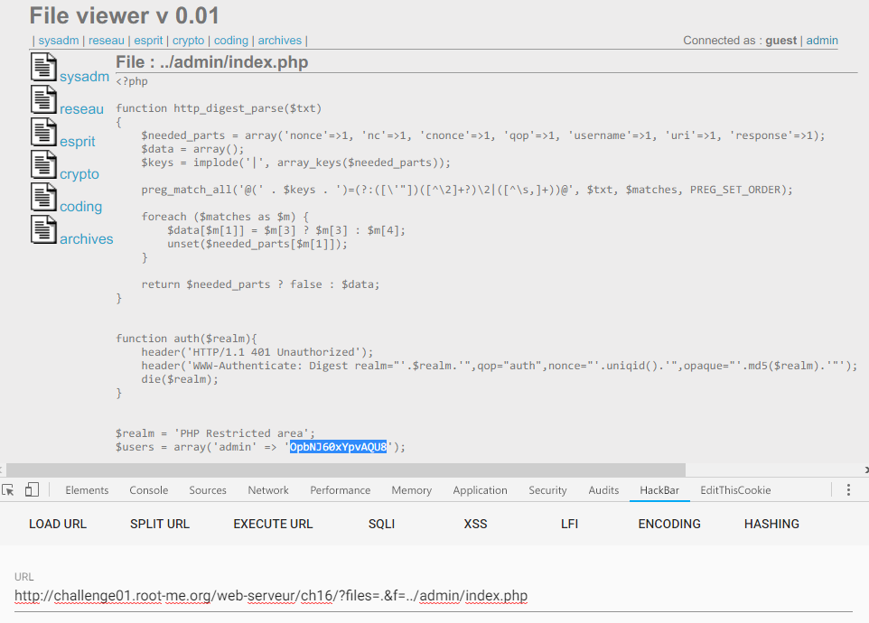

Root-Me [Local File Inclusion](https://www.root-me.org/en/Challenges/Web-Server/Local-File-Inclusion)
===

看樣子是一個檔案檢視器，提供檔案瀏覽功能。

## 解題關鍵
1. LFI

## 提示訊息
```
Get in the admin section.
```

## 解題方法
LFI 為 Local File Inclusion 的縮寫，意思是本地包含漏洞，但該題不小心就秒解了...，首先隨意點集上方的連結，可發現隨即出現該文件的程式碼。  

首先頁面右側有個 `admin` 選項，點擊後便要輸入帳號及密碼，沒有其他線索了。  

隨後發現 URL 的變化，簡單測試 URL 參數 `files` 與 `f`，`files` 帶不帶值都無所謂，主要是 `f` 指向要瀏覽的檔案，所以直覺就下了 `f=index.php`，發現沒有任何東西，向上探勘 `f=../index.php`。

```
http://challenge01.root-me.org/web-serveur/ch16/?files&f=../index.php
```

接著要找的是 `admin`，就不小心猜到路徑 `../admin/index.php`，解決該題。



## Reference

## 授權聲明
[](https://mks.tw/)
[](https://www.gnu.org/licenses/gpl-3.0)