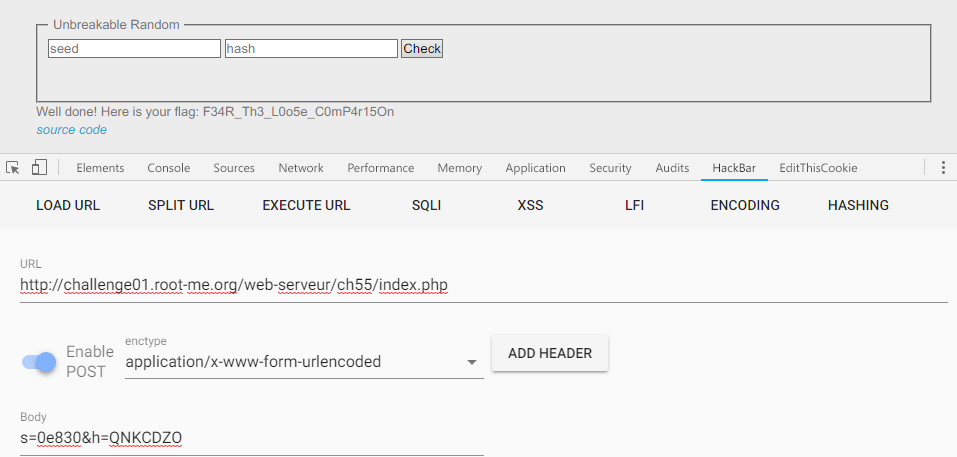

Root-Me [PHP - Loose Comparison](https://www.root-me.org/en/Challenges/Web-Server/PHP-Loose-Comparison)
===

兩個 Input，然後可以看 Source Code。

## 解題關鍵
1. PHP Code Review
2. Loose Comparison

## 提示訊息
```
Find a way to get the flag.
No bruteforce needed.

Start the challenge
```

## 解題方法
該題提供兩個可以送的參數，並且給予原始碼，簡單閱讀關鍵點。  

```PHP
<?php
if (isset($_POST['s']) && isset($_POST['h'])) {
    $s = sanitize_user_input($_POST['s']);
    $h = secured_hash_function($_POST['h']);
    $r = gen_secured_random();
    if($s != false && $h != false) {
        if($s.$r == $h) {
            print "Well done! Here is your flag: ".$flag;
        }
        else {
            print "Fail...";
        }
    }
    else {
        print "<p>Hum ...</p>";
    }
}
?>
```

可以看到參數 `s`、`h` 兩個，`s` 會加上 `r` 亂數，`h` 則是做了 `md5 hash`，但注意到 `if($s.$r == $h)` 的部分，僅有兩個 `=`，在 PHP 上稱為弱型別判斷。  

舉個簡單的例子:  
```php
<?php
md5('QNKCDZO') == '0e830400451993494058024219903391' //True
'0e8356456456' == '0e83040' //True

//So
'0e830' == md5('QNKCDZO') //True
```

所以送出的參數 `s=0e830`、`h=QNKCDZO`，解決該題。

  

## Reference
https://itw01.com/VI7CLEQ.html

## 授權聲明
[](https://mks.tw/)
[](https://www.gnu.org/licenses/gpl-3.0)