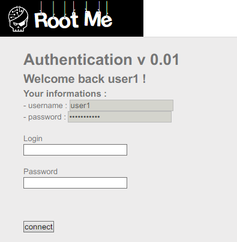
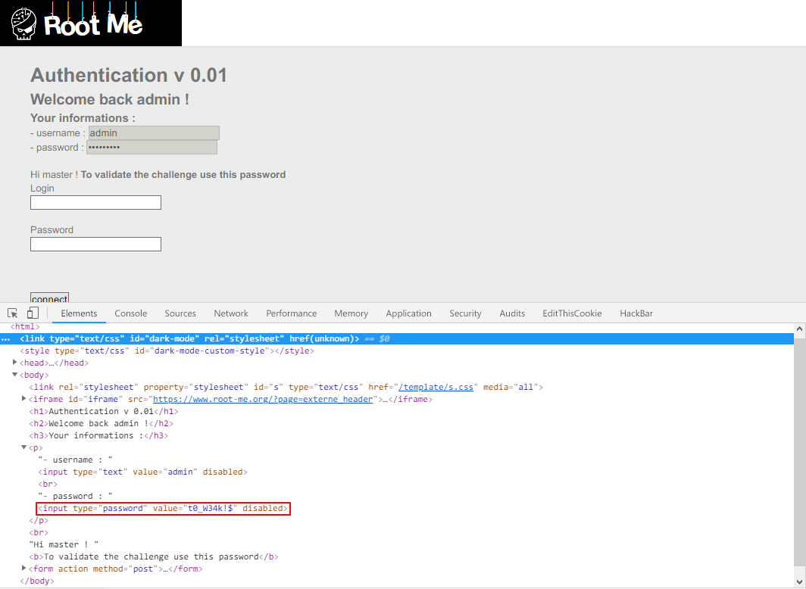

Root-Me [SQL injection - authentication](https://www.root-me.org/en/Challenges/Web-Server/SQL-injection-authentication)
===

簡單的登入頁面。

## 解題關鍵
1. SQL-Injection

## 提示訊息
```
Retrieve the administrator password
```

## 解題方法
這部分就不講解原理，該題是很基礎的題目，由於秒解，但還是紀錄解題過程。  

首先使用 `' OR 1 = 1 --` 當作帳號與密碼進行登入，可以發現已經成功登入 `user1`。  

  

但目標是 admin 而不是 `user1`，這時候有兩種解法。  
1. `admin' AND 1 = 1 --`
2. `' or 1 = 1 limit n,1 --`

第一種解法需要猜對 `User` 的名稱，而第二種解法是需要猜 `admin` 的資料庫序位。  

成功登入之後，便可以發現登入身分變成了 `admin`，這時候開啟開發者模式，就可以看到 `admin` 的明文密碼，解決該題。  

  

## Reference

## 授權聲明
[](https://mks.tw/)
[](https://www.gnu.org/licenses/gpl-3.0)