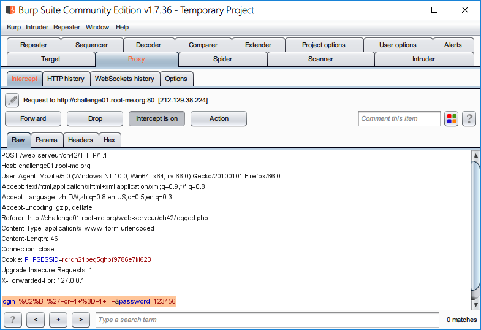
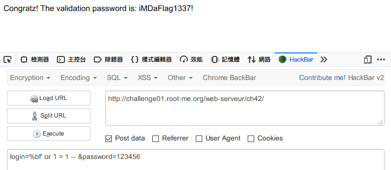

Root-Me [SQL injection - authentication - GBK](https://www.root-me.org/en/Challenges/Web-Server/SQL-injection-authentication-GBK)
===

簡單的登入頁面。

## 解題關鍵
1. SQL-Injection

## 提示訊息
```
Get an administrator access.
```

## 解題方法
題目上已經給了提示 `GBK`，簡單的說就是用 `Big5/GBK` 編碼來繞過 WAF，但實際原理是什麼呢?  

假設輸入的攻擊語法如下:

```
http://mksyi/index.php?id=2'
```

結果單引號的部分被強加跳脫字元 `\`，執行的的 SQL 會終會變成以下的樣子。  

```
SELECT * FROM news WHERE id = '2\''
```

這時候如果加上 `%df` 如下。  

```
http://mksyi/index.php?id=2%df'
```

會變成 `2%df%5c%27` 解析後就是 `2運'`。  
1. 2 => `2`
2. %df%5c => `運`
3. %27 => `'`

可以看到輸入 `%df` 卻把自動補上的跳脫字元 `\` 給吃掉，變成 `%df%5c`，經過解析後變成中文字 `運`。  

回到題目，是一個登入頁面，輸入什麼都回應錯誤訊息 `Erreur d'identification`，長時間測試 `%df' or 1 = 1 --` 的 Payload 進行攻擊都無法成功，此時覺得很奇怪，若該題真的是 `GBK Injection` 的話，那怎麼會行不通呢?  

最後構造 Payload 如下:

```
login=%bf' or 1 = 1 -- &password=123456
```

並用 `Brup Suite` 進行觀察。  

  

可以發現 Login 的部分被自動補上 `%C2`，根據參考資料顯示，`%C2` 是 `encodeURI`、`encodeURIComponent` 的標頭，但不知道為什麼這邊自動被加上去了，所以 Payload 變成了 `%C2%BF' 1 = 1 --`，導致注入沒有成功。  

將其修改為 `%BF'+1+=+1+--`（空格部分會被`+`取代），並且 `Forward`，即可注入成功，如下，解決該題。  

  

## 補充
隨後也參考了其他人的 Write-up。  
```
User:呵' or 1=1 #
Passwd:123
```

感覺滿奇妙的，透過 `Brup Suite` 檢視編碼後得到 `%E5%91%B5' or 1=1 #`，`呵` 這個字輩解析成 `%E5%91%B5` 由三個編碼組成，但基本上解析會倆倆為一組，所以 `%E5%91`，後方的 `%B5%` 原先應該會與 `%27` 揍一組，但是自動補上跳脫字元的關係 `\` 變成編碼 `%5C`，就與 `%B5` 揍一組，形成 `%5C%B5`，剩下的 `%27` 就獨立閉合前方的 SQL 來達成 SQL-Injection。  

不過這部分也學到了一點，只要能成功與自動補齊的 `%5C` 揍成雙數，就可以繞過該題的 WAF，所以上方的解題方法不論是 `%BF` 或是 `%AA` 只要能夠與 `%5C` 揍一對，形成什麼樣的字其實都無所謂。  

```
User: 帥' or 1 = 1 #
User: 我很帥' or 1 = 1 #
User: 我非常的帥' or 1 = 1 #
```

## Reference
https://klionsec.github.io/2016/05/15/mysql-wide-byte-injection/
http://www.javascripter.net/faq/escape-encodeuri-upper-ascii.htm

## 授權聲明
[](https://mks.tw/)
[](https://www.gnu.org/licenses/gpl-3.0)